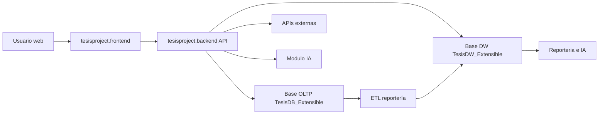
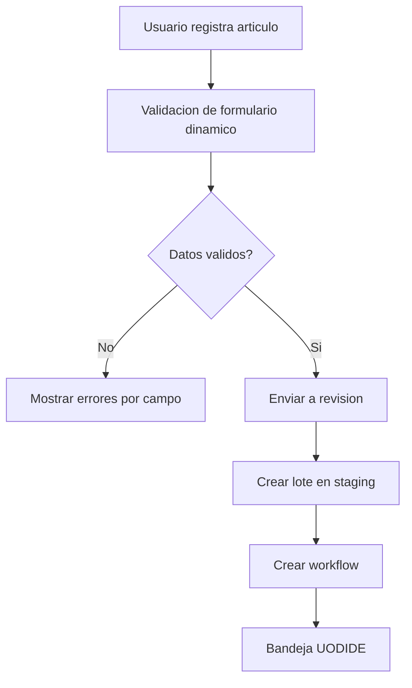
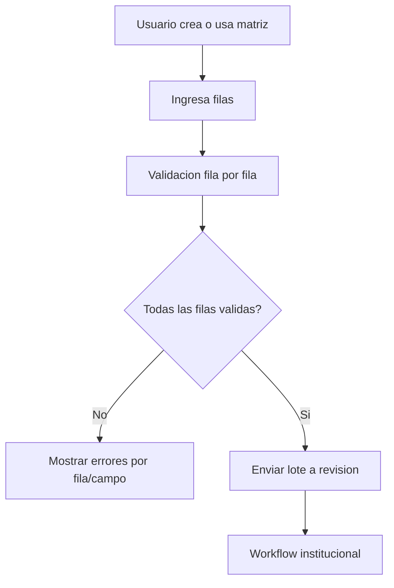
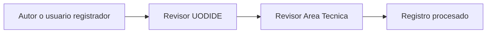
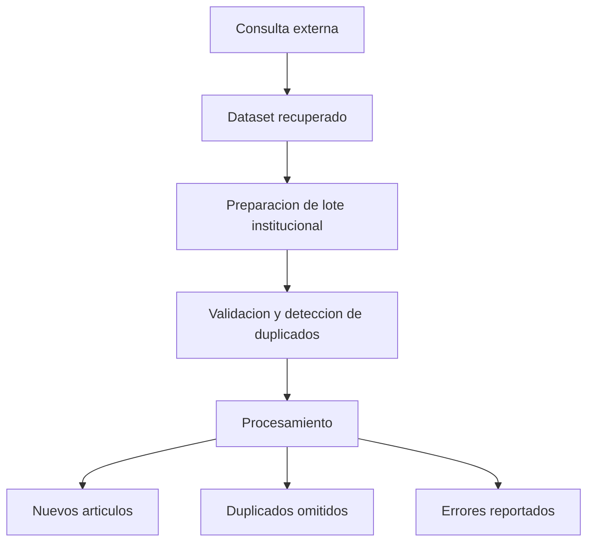
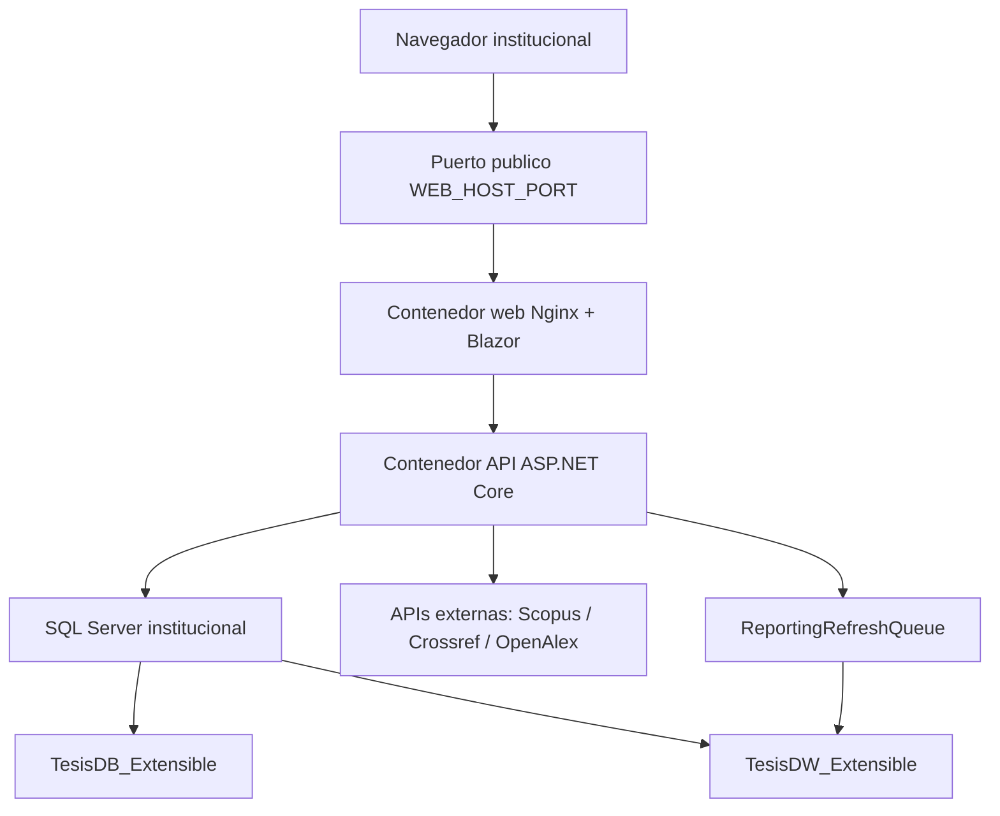
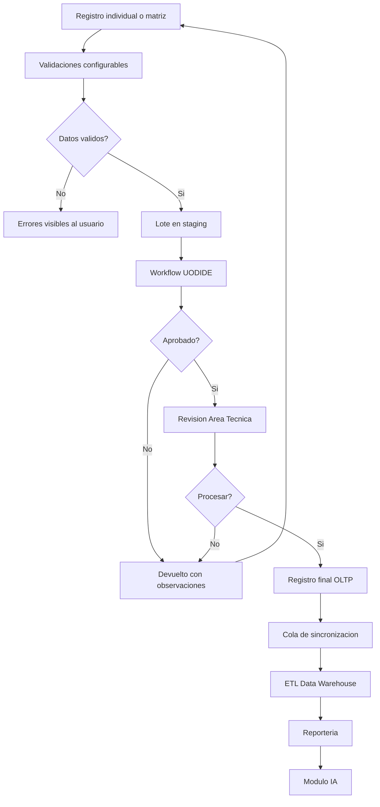
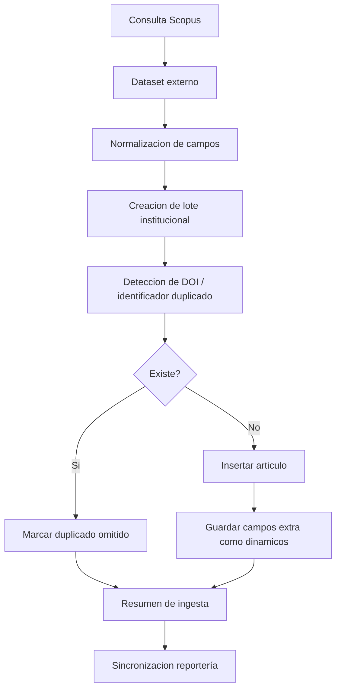
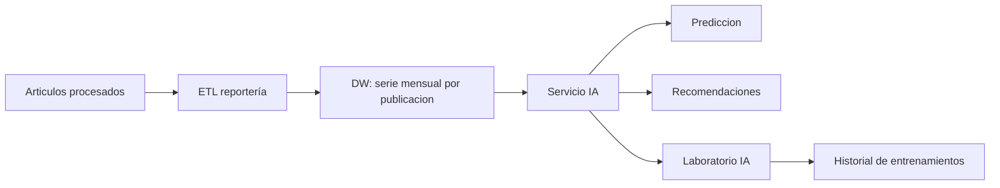

# Manual tecnico del sistema de gestion de produccion cientifica

## 1. Introduccion tecnica

Este documento describe la estructura tecnica, arquitectura, componentes, flujos, configuraciones y consideraciones de mantenimiento del sistema de gestion de produccion cientifica.

El manual esta orientado a administradores tecnicos, desarrolladores, personal de soporte, responsables de despliegue y personal institucional encargado de mantener el sistema operativo.

El sistema permite gestionar articulos cientificos mediante formularios configurables, flujos de revision, carga individual, carga masiva, ingesta externa, reportería institucional e inteligencia artificial para prediccion y recomendacion academica.

## 2. Descripcion general del sistema

El sistema centraliza el registro, validacion, revision, procesamiento y analisis de articulos cientificos institucionales.

Sus principales objetivos tecnicos son:

- Mantener una base transaccional para la operacion diaria.
- Permitir configuracion dinamica de formularios, campos, validaciones y catalogos.
- Gestionar flujos de revision institucional.
- Procesar cargas masivas e ingestas externas.
- Sincronizar datos hacia un modelo analitico.
- Generar indicadores, reportes y exportaciones.
- Proveer predicciones y recomendaciones mediante un modulo de inteligencia artificial.

## 3. Arquitectura general

La solucion esta organizada en tres proyectos principales:

| Proyecto | Funcion |
| --- | --- |
| `tesisproject.backend` | API, seguridad, servicios de negocio, persistencia, ETL, reportería e IA |
| `tesisproject.frontend` | Aplicacion web Blazor, paginas, componentes, clientes HTTP y UX |
| `tesisproject.shared` | DTOs, contratos, wrappers y validaciones compartidas |

La comunicacion general es:



## 4. Tecnologias utilizadas

| Capa | Tecnologia |
| --- | --- |
| Backend | .NET 9 / ASP.NET Core |
| Frontend | Blazor WebAssembly |
| Base de datos | SQL Server |
| ORM | Entity Framework Core |
| Seguridad | ASP.NET Identity + JWT |
| Estilos | CSS modular, Bootstrap Icons, estilos propios del sistema |
| Exportacion | CSV / Excel |
| Contenedores | Docker / Docker Compose |
| Reporteria | Data Warehouse SQL Server + vistas + procedimientos ETL |
| IA | Servicio backend de inteligencia institucional con modelos temporales y seleccion por metricas |

## 5. Estructura del repositorio

Estructura principal:

```text
TesisProject/
  TesisProject.sln
  docker-compose.yml
  docker-compose.env.example
  docs/
  scripts/
  tesisproject.backend/
  tesisproject.frontend/
  tesisproject.shared/
  tests/
```

### 5.1 Backend

Carpetas principales:

```text
tesisproject.backend/
  Configuration/
  Controllers/
  Data/
  DataWarehouse/
  Errors/
  Identity/
  Mapping/
  Migrations/
  Options/
  Reporting/
  Services/
```

Funciones principales:

- `Configuration`: registro de servicios, persistencia, autenticacion y dependencias.
- `Controllers`: endpoints HTTP organizados por modulo.
- `Data`: contexto OLTP y entidades transaccionales.
- `DataWarehouse`: entidades y contexto del modelo analitico.
- `Identity`: autenticacion, usuarios, roles, tokens y auditoria.
- `Reporting`: contexto de consultas al DW.
- `Services`: servicios de negocio por modulo.

### 5.2 Frontend

Carpetas principales:

```text
tesisproject.frontend/
  Configuration/
  Features/
  Layout/
  Models/
  Services/
  SharedUI/
  Styles/
  Utils/
  wwwroot/
```

La carpeta `Features` agrupa las paginas y componentes por modulo funcional.

### 5.3 Shared

```text
tesisproject.shared/
  Abstractions/
  DTOs/
  Validation/
  Wrappers/
```

Este proyecto contiene contratos compartidos entre backend y frontend, evitando duplicacion de estructuras de datos.

## 6. Modulos principales

| Modulo | Descripcion tecnica |
| --- | --- |
| Seguridad | Autenticacion, roles, permisos y tokens JWT |
| Configuracion | Formularios, campos, validaciones, catalogos y matrices |
| Registro | Registro individual y envio a revision |
| Matriz | Carga masiva controlada por filas y validaciones |
| Workflow | Seguimiento, revision UODIDE, revision Area Tecnica y procesamiento |
| Articulos | Listado, consulta, detalle, exportacion y mantenimiento |
| Ingesta externa | Integracion con fuentes academicas externas como Scopus |
| Staging | Lotes, filas, valores, errores y correcciones |
| Reporteria | Indicadores institucionales, graficos, filtros y exportaciones |
| IA | Predicciones, recomendaciones, laboratorio y reentrenamiento |

## 7. Backend: controladores principales

| Controlador | Funcion |
| --- | --- |
| `AuthController` | Inicio de sesion, usuario actual y gestion de sesion |
| `IdentityAdministrationController` | Administracion de usuarios, roles y permisos |
| `ConfigurationController` | Formularios, campos y configuraciones dinamicas |
| `CatalogsController` | Catalogos administrativos |
| `ArticleRegistrationController` | Registro individual y envio a revision |
| `RegistrationMatricesController` | Matrices de registro |
| `BulkImportController` | Staging, validacion y procesamiento de lotes |
| `WorkflowController` | Bandejas, acciones y seguimiento del workflow |
| `ArticlesController` | Listado, detalle, exportacion y mantenimiento de articulos |
| `ExternalApiExplorerController` | Busqueda, preparacion e ingesta externa |
| `ReportingController` | Reporteria institucional y sincronizacion ETL |
| `IntelligenceController` | Dashboard IA, entrenamiento e historial |
| `VenuesController` | Gestion de revistas y metricas asociadas |

## 8. Backend: servicios principales

| Servicio | Responsabilidad |
| --- | --- |
| `IdentityAuthService` | Autenticacion y emision de tokens |
| `IdentityAdministrationService` | Gestion de usuarios, roles y permisos |
| `ConfigurationFormsService` | Formularios dinamicos, campos y validaciones |
| `ArticleRegistrationService` | Registro agregado y envio a revision |
| `ArticleAggregatePersistenceService` | Persistencia final de articulo, participantes y campos dinamicos |
| `RegistrationMatrixService` | Gestion de matrices de registro |
| `BulkImportService` | Staging, validacion, correccion y procesamiento de lotes |
| `WorkflowService` | Flujo Autor -> UODIDE -> Area Tecnica |
| `ExternalApiExplorerService` | Integracion con APIs externas |
| `ArticlesService` | Consulta, detalle, exportacion y mantenimiento de articulos |
| `InstitutionalReportingService` | Reporteria institucional y ejecucion del ETL |
| `ReportingRefreshQueue` | Sincronizacion automatica de reportería en segundo plano |
| `InstitutionalIntelligenceService` | Predicciones, recomendaciones y entrenamiento IA |

## 9. Modelo de datos OLTP

La base transaccional principal es `TesisDB_Extensible`.

Tablas relevantes:

| Grupo | Tablas |
| --- | --- |
| Seguridad | `AspNetUsers`, `AspNetRoles`, `AspNetUserRoles`, claims |
| Articulos | `Articles`, `ArticleParticipants`, `ArticleIndexings`, `ArticleFiles` |
| Catalogos | `AcademicTerms`, `PublicationStatuses`, `ResearchLines`, `Faculties`, `IndexingSources`, `Venues`, `VenueMetrics` |
| Campos dinamicos | `FieldCatalog`, `DynamicFieldOptions`, `DynamicFieldValues`, `ArticleParticipantDynamicFieldValues` |
| Formularios | `FormDefinitions`, `FormFields` |
| Staging | `ImportBatch`, `ImportBatchRow`, `ImportBatchRowValue`, `ImportBatchError` |
| Workflow | `WorkflowDefinition`, `WorkflowStageDefinition`, `WorkflowInstance`, `WorkflowStageInstance`, `WorkflowActionLog` |
| Matrices | `RegistrationMatrix`, `RegistrationMatrixColumn`, `RegistrationMatrixRow`, `RegistrationMatrixCell` |
| IA | `IntelligenceTrainingRuns`, `IntelligenceTrainingAlgorithmMetrics` |
| Medicion | `ReportingPerformanceMetrics` |

## 10. Modelo analitico DW

La base analitica principal es `TesisDW_Extensible`.

Componentes principales:

| Tipo | Elementos |
| --- | --- |
| Dimensiones | `DimDate`, `DimArticle`, `DimAuthor`, `DimVenue`, `DimResearchLine`, `DimPublicationStatus`, `DimField`, `DimIndexingSource` |
| Hechos | `FactArticlePublication`, `FactArticleAuthor`, `FactArticleIndexing`, `FactVenueMetricYear` |
| Vistas | `dw.vw_Articles_Detail`, `dw.vw_Articles_ByYear`, `dw.vw_KPI_ProduccionCientifica`, `dw.vw_QuartileDistribution`, entre otras |
| ETL | `etl.sp_RunFullLoad` |

La reportería debe utilizar la fecha de publicacion del articulo como eje temporal principal. Cuando no exista fecha de publicacion, se usa la fecha de registro como respaldo.

## 11. Flujo de registro individual



Validaciones aplicadas:

- Campos obligatorios configurados.
- Reglas de tipo de dato.
- Longitud maxima.
- Fechas no futuras.
- DOI duplicado.
- Participantes obligatorios.
- Orden de participantes.
- Validaciones de revista, ISSN y cuartil cuando apliquen.

## 12. Flujo de matriz de registro



La matriz permite registrar varios articulos en un mismo lote. Cada fila representa un articulo y puede contener uno o varios participantes.

## 13. Flujo de workflow

Flujo principal:



Reglas principales:

- UODIDE puede tomar o no tomar un caso.
- UODIDE puede devolver al autor con observaciones.
- Area Tecnica realiza la validacion final.
- Area Tecnica puede devolver al autor o a UODIDE segun el caso.
- Solo Area Tecnica puede procesar definitivamente la informacion.
- Al procesar, la informacion pasa del staging al modelo principal.

## 14. Staging y carga masiva

El staging esta compuesto por lotes, filas, valores y errores.

| Entidad | Funcion |
| --- | --- |
| `ImportBatch` | Cabecera del lote |
| `ImportBatchRow` | Fila individual del lote |
| `ImportBatchRowValue` | Valores por campo |
| `ImportBatchError` | Errores o advertencias de validacion |

El staging permite:

- Validar antes de registrar.
- Corregir errores.
- Procesar solo informacion aprobada.
- Mantener trazabilidad del lote.
- Identificar duplicados.
- Reportar resultados de procesamiento.

## 15. Ingesta externa

El modulo de ingesta externa permite consultar fuentes academicas y preparar datos para alimentar el modelo institucional.

Fuente principal implementada:

- Scopus.

Flujo general:



Reglas relevantes:

- Si existe DOI, se usa como criterio principal de duplicidad.
- Si no existe DOI, se utilizan identificadores externos.
- Si no existe identificador, se puede comparar titulo, anio y revista.
- Los campos externos que no forman parte del modelo principal se guardan como campos dinamicos.
- La fecha de publicacion de Scopus se conserva para reportería e IA.

## 16. Reporteria institucional

La reportería se alimenta desde el DW `TesisDW_Extensible`.

Componentes:

- KPIs institucionales.
- Graficos por anio, mes, facultad, linea, revista, cuartil y autores.
- Filtros avanzados.
- Exportacion para analisis externo.
- Medicion de tiempos de reportería.

La sincronizacion puede ejecutarse:

- Manualmente desde el modulo de reportería.
- Automaticamente desde `ReportingRefreshQueue` despues de cambios relevantes.

Eventos que encolan sincronizacion automatica:

- Procesamiento de lote.
- Procesamiento de ingesta externa.
- Registro directo.
- Creacion directa de articulo.
- Actualizacion de articulo.
- Eliminacion de articulo.

## 17. Inteligencia artificial

El modulo IA consume la serie mensual de produccion cientifica desde reportería.

Funciones:

- Prediccion de produccion cientifica.
- Recomendaciones institucionales.
- Senales por facultad.
- Senales por lineas de investigacion.
- Senales editoriales.
- Senales de autores y colaboracion.
- Laboratorio de modelos.
- Historial de reentrenamientos.

Datos usados:

- Articulos procesados.
- Fecha de publicacion.
- Produccion mensual.
- Autores y trazabilidad.
- Facultades.
- Lineas de investigacion.
- Indexacion, cuartil y acceso abierto.

La fecha principal para IA es la fecha de publicacion del articulo. Si no existe, se usa fecha de registro como respaldo.

## 18. Algoritmos y seleccion del modelo IA

El modulo compara modelos de prediccion temporal y selecciona el mejor candidato segun metricas.

Metricas usadas:

| Metrica | Descripcion |
| --- | --- |
| MAE | Error absoluto medio. Se usa como metrica principal de seleccion. |
| RMSE | Penaliza errores grandes. Se usa como metrica complementaria. |
| MAPE | Error porcentual. Se usa como senal complementaria, especialmente sensible en meses con baja produccion. |

Modelos considerados:

- Persistencia del ultimo valor.
- Promedio movil.
- Regresion temporal.
- Forecasting temporal ML.NET cuando la serie lo permite.

El reentrenamiento registra:

- Fecha de ejecucion.
- Usuario o disparador.
- Algoritmo promovido.
- Version del modelo.
- Metricas obtenidas.
- Estado del entrenamiento.

## 19. Seguridad

El sistema utiliza:

- ASP.NET Identity.
- JWT Bearer Token.
- Roles.
- Permisos asignables.
- Politicas de autorizacion.
- Restriccion por endpoints.
- Restriccion por vistas en frontend.

Roles funcionales principales:

- Administrador.
- Autor.
- Revisor UODIDE.
- Revisor Area Tecnica.
- Analista.
- Visualizador de reportería.
- Usuario de IA.
- Entrenador IA.

El administrador puede asignar permisos de forma granular, por ejemplo:

- Registro.
- Reporteria.
- Carga masiva.
- APIs externas.
- Configuracion.
- Usuarios y roles.
- IA.

## 20. Configuracion dinamica

El sistema permite configurar formularios y campos sin modificar codigo.

Componentes:

- `FieldCatalog`: catalogo de campos.
- `FormDefinitions`: formularios.
- `FormFields`: asociacion formulario-campo.
- `DynamicFieldOptions`: opciones de campos tipo catalogo.
- `DynamicFieldValues`: valores dinamicos de articulos.

Validaciones configurables:

- Requerido.
- Longitud maxima.
- Tipo de dato.
- Numerico.
- Fecha.
- Expresiones o reglas.
- Opciones de seleccion.
- Mensajes de ayuda.

## 21. APIs externas

El sistema contempla integracion con fuentes academicas externas.

Configuracion esperada:

```text
ExternalApis__Scopus__ApiKey
ExternalApis__Scopus__InstToken
ExternalApis__Crossref__ApiKey
ExternalApis__OpenAlex__ApiKey
ExternalApis__SemanticScholar__ApiKey
```

Las claves deben configurarse como variables de entorno o en archivos de configuracion protegidos.

## 22. Dockerizacion

El repositorio contiene:

```text
docker-compose.yml
docker-compose.env.example
tesisproject.backend/Dockerfile
tesisproject.frontend/Dockerfile
tesisproject.frontend/nginx/
```

Servicios principales:

- `api`: backend ASP.NET Core.
- `web`: frontend servido por Nginx.

Variables de entorno relevantes:

```text
WEB_HOST_PORT
DB_HOST
DB_PORT
DB_USER
DB_PASS
DB_OLTP_NAME
DB_DW_NAME
DB_REPORTING_NAME
JWT_ISSUER
JWT_AUDIENCE
JWT_KEY
JWT_EXPIRATION_MINUTES
```

Comando base:

```bash
docker compose --env-file .env -p tesis-articulos up -d --build
```

Verificacion:

```bash
docker compose -p tesis-articulos ps
docker compose -p tesis-articulos logs --tail=120 api
docker compose -p tesis-articulos logs --tail=120 web
```

## 23. Instalacion local

Requisitos:

- .NET 9 SDK.
- SQL Server.
- Node/npm si se requiere restaurar dependencias frontend.
- Acceso a bases `TesisDB_Extensible` y `TesisDW_Extensible`.

Compilar:

```bash
dotnet build TesisProject.sln --no-restore
```

Ejecutar backend:

```bash
dotnet run --project tesisproject.backend/tesisproject.backend.csproj
```

Ejecutar frontend:

```bash
dotnet run --project tesisproject.frontend/tesisproject.frontend.csproj
```

## 24. Restauracion de bases de datos

Restauracion SQL Server desde backup:

```sql
RESTORE DATABASE [TesisDB_Extensible]
FROM DISK = N'/var/opt/mssql/backup/TesisDB_Extensible.bak'
WITH
    MOVE N'TesisDB_Extensible' TO N'/var/opt/mssql/data/TesisDB_Extensible.mdf',
    MOVE N'TesisDB_Extensible_log' TO N'/var/opt/mssql/data/TesisDB_Extensible_log.ldf',
    REPLACE,
    RECOVERY,
    STATS = 10;
```

```sql
RESTORE DATABASE [TesisDW_Extensible]
FROM DISK = N'/var/opt/mssql/backup/TesisDW_Extensible.bak'
WITH
    MOVE N'TesisDW_Extensible' TO N'/var/opt/mssql/data/TesisDW_Extensible.mdf',
    MOVE N'TesisDW_Extensible_log' TO N'/var/opt/mssql/data/TesisDW_Extensible_log.ldf',
    REPLACE,
    RECOVERY,
    STATS = 10;
```

Verificacion:

```sql
SELECT name FROM sys.databases ORDER BY name;
```

```sql
USE TesisDW_Extensible;
SELECT SCHEMA_NAME(schema_id) AS SchemaName, name
FROM sys.procedures
WHERE name = 'sp_RunFullLoad';
```

## 25. Mantenimiento operativo

Actividades recomendadas:

- Revisar logs del backend.
- Ejecutar backups periodicos.
- Verificar espacio en disco.
- Verificar estado de Docker.
- Probar conexion a SQL Server.
- Ejecutar sincronizacion de reportería si se detectan datos no actualizados.
- Revisar lotes con errores en staging.
- Revisar entrenamientos IA despues de nuevos meses cargados.

Comandos Docker utiles:

```bash
docker compose -p tesis-articulos ps
docker compose -p tesis-articulos logs --tail=120 api
docker compose -p tesis-articulos logs --tail=120 web
docker compose -p tesis-articulos restart api
docker compose -p tesis-articulos down
docker compose -p tesis-articulos up -d
```

## 26. Pruebas recomendadas

Pruebas funcionales prioritarias:

1. Inicio de sesion por rol.
2. Asignacion de permisos.
3. Configuracion de formulario activo.
4. Registro individual.
5. Validacion de campos obligatorios.
6. Registro por matriz.
7. Envio a workflow.
8. Revision UODIDE.
9. Revision Area Tecnica.
10. Procesamiento final.
11. Consulta en listado de articulos.
12. Sincronizacion de reportería.
13. Visualizacion de reportes.
14. Ingesta externa.
15. Deteccion de duplicados.
16. Prediccion IA.
17. Reentrenamiento IA.
18. Exportacion CSV/Excel.

## 27. Problemas comunes

| Problema | Posible causa | Solucion |
| --- | --- | --- |
| No conecta a base de datos | Cadena de conexion incorrecta | Revisar variables `DB_HOST`, `DB_PORT`, usuario y clave |
| Reportería no muestra datos recientes | ETL no ejecutado o fallo en sincronizacion | Ejecutar sincronizacion manual y revisar logs |
| IA no muestra prediccion | Serie mensual insuficiente | Cargar mas meses con fecha de publicacion |
| Error en ingesta externa | API sin clave o timeout | Revisar claves y logs |
| Registro no avanza en workflow | Caso no tomado o no aprobado | Revisar estado del lote y etapa actual |
| Campo requerido aparece aunque se quito del formulario | Configuracion desactualizada o validacion fisica activa | Revisar formulario activo y campos requeridos |
| Articulos duplicados | DOI o identificador externo no informado | Revisar reglas de deduplicacion y datos fuente |

## 28. Consideraciones de produccion

Antes de publicar en servidor:

- Confirmar que las bases correctas son `TesisDB_Extensible` y `TesisDW_Extensible`.
- Verificar variables de entorno.
- Usar una clave JWT segura.
- No subir archivos `.env` con credenciales a repositorios publicos.
- Validar puertos disponibles.
- Confirmar que SQL Server permite conexion desde contenedores.
- Ejecutar prueba de login.
- Ejecutar prueba de registro.
- Ejecutar prueba de reportería.
- Ejecutar prueba de IA.
- Confirmar backups de ambas bases.

## 29. Anexos tecnicos

### 29.1 Comando de compilacion

```bash
dotnet build TesisProject.sln --no-restore
```

### 29.2 Comando de despliegue Docker

```bash
docker compose --env-file .env -p tesis-articulos up -d --build
```

### 29.3 Comando para verificar contenedores

```bash
docker compose -p tesis-articulos ps
```

### 29.4 Comando para consultar logs

```bash
docker compose -p tesis-articulos logs --tail=120 api
docker compose -p tesis-articulos logs --tail=120 web
```

### 29.5 Procedimiento ETL principal

```sql
EXEC etl.sp_RunFullLoad;
```

### 29.6 Bases de datos principales

```text
TesisDB_Extensible
TesisDW_Extensible
```

## 30. Mapa de endpoints principales

Los endpoints se publican bajo rutas historicas y rutas del modulo de produccion cientifica. En general, las rutas modernas usan el prefijo:

```text
/api/scientific-production
```

### 30.1 Seguridad y autenticacion

| Metodo | Ruta | Funcion | Politica |
| --- | --- | --- | --- |
| POST | `/api/auth/login` | Inicio de sesion | Publico |
| GET | `/api/auth/me` | Usuario autenticado actual | `AuthenticatedUser` |
| POST | `/api/auth/accept-terms` | Aceptacion de terminos | `AuthenticatedUser` |
| POST | `/api/auth/register` | Registro administrativo de usuario | `SecurityAdministration` |
| GET | `/api/admin/security/users` | Listar usuarios | `SecurityAdministration` |
| GET | `/api/admin/security/roles` | Listar roles | `SecurityAdministration` |
| POST | `/api/admin/security/users` | Crear usuario | `SecurityAdministration` |
| POST | `/api/admin/security/roles` | Crear rol | `SecurityAdministration` |
| PUT | `/api/admin/security/users/{userId}/roles` | Asignar roles a usuario | `SecurityAdministration` |

### 30.2 Configuracion, formularios y catalogos

| Metodo | Ruta | Funcion | Politica |
| --- | --- | --- | --- |
| GET | `/api/scientific-production/config/forms` | Listar formularios | `AuthenticatedUser` |
| GET | `/api/scientific-production/config/forms/{formId}/fields` | Campos de formulario | `AuthenticatedUser` |
| GET | `/api/scientific-production/config/fields` | Listar campos | `AuthenticatedUser` |
| GET | `/api/scientific-production/config/fields/dynamic` | Listar campos dinamicos | `AuthenticatedUser` |
| POST | `/api/scientific-production/config/forms` | Crear formulario | `ConfigurationAdministration` |
| PUT | `/api/scientific-production/config/forms/{formId}` | Actualizar formulario | `ConfigurationAdministration` |
| DELETE | `/api/scientific-production/config/forms/{formId}` | Eliminar formulario | `ConfigurationAdministration` |
| POST | `/api/scientific-production/config/fields/dynamic` | Crear campo dinamico | `ConfigurationAdministration` |
| PUT | `/api/scientific-production/config/fields/{fieldId}` | Actualizar campo | `ConfigurationAdministration` |
| DELETE | `/api/scientific-production/config/fields/{fieldId}` | Eliminar campo | `ConfigurationAdministration` |
| GET | `/api/scientific-production/catalogs/{catalogo}` | Consultar catalogo | `AuthenticatedUser` |
| GET | `/api/scientific-production/catalogs/admin/{catalogKey}` | Administrar catalogo | `ConfigurationAdministration` |
| POST | `/api/scientific-production/catalogs/admin/{catalogKey}` | Crear item de catalogo | `ConfigurationAdministration` |
| PUT | `/api/scientific-production/catalogs/admin/{catalogKey}/{id}` | Actualizar item | `ConfigurationAdministration` |
| DELETE | `/api/scientific-production/catalogs/admin/{catalogKey}/{id}` | Eliminar item | `ConfigurationAdministration` |

### 30.3 Registro, matriz, staging y workflow

| Metodo | Ruta | Funcion | Politica |
| --- | --- | --- | --- |
| POST | `/api/scientific-production/articles/aggregate` | Registrar articulo directo | `ArticlesWrite` |
| POST | `/api/scientific-production/articles/aggregate/submit-for-review` | Enviar articulo a revision | `AuthorSubmission` |
| GET | `/api/scientific-production/registration-matrices` | Listar matrices | `AuthenticatedUser` |
| POST | `/api/scientific-production/registration-matrices` | Crear matriz | `AuthorSubmission` |
| PUT | `/api/scientific-production/registration-matrices/{matrixId}` | Actualizar matriz | `ConfigurationAdministration` |
| DELETE | `/api/scientific-production/registration-matrices/{matrixId}` | Eliminar matriz | `ConfigurationAdministration` |
| POST | `/api/scientific-production/registration-matrices/{matrixId}/rows` | Agregar fila | `AuthorSubmission` |
| PUT | `/api/scientific-production/registration-matrices/{matrixId}/rows/{rowId}/cells` | Actualizar celdas | `AuthorSubmission` |
| POST | `/api/scientific-production/registration-matrices/{matrixId}/submit` | Enviar matriz a revision | `AuthorSubmission` |
| GET | `/api/scientific-production/import-batches` | Listar lotes | `BulkImportAccess` |
| GET | `/api/scientific-production/import-batches/{batchId}` | Detalle de lote | `BulkImportAccess` |
| POST | `/api/scientific-production/import-batches/{batchId}/validate` | Validar lote | `BulkImportAccess` |
| POST | `/api/scientific-production/import-batches/{batchId}/process` | Procesar lote | `WorkflowProcess` |
| GET | `/api/scientific-production/workflows/import-batches/inbox/review` | Bandeja de revision | `WorkflowReview` |
| GET | `/api/scientific-production/workflows/import-batches/inbox/author` | Bandeja del autor | `WorkflowAccess` |
| POST | `/api/scientific-production/workflows/import-batches/{batchId}/claim` | Tomar caso | `WorkflowReview` |
| POST | `/api/scientific-production/workflows/import-batches/{batchId}/return` | Devolver al autor | `WorkflowReview` |
| POST | `/api/scientific-production/workflows/import-batches/{batchId}/return-to-uodide` | Devolver a UODIDE | `WorkflowReview` |
| POST | `/api/scientific-production/workflows/import-batches/{batchId}/approve` | Aprobar etapa | `WorkflowReview` |
| POST | `/api/scientific-production/workflows/import-batches/{batchId}/resubmit` | Reenviar correcciones | `WorkflowAccess` |
| POST | `/api/scientific-production/workflows/import-batches/{batchId}/cancel` | Cancelar envio | `WorkflowAccess` |

### 30.4 Articulos, ingesta, reportería e IA

| Metodo | Ruta | Funcion | Politica |
| --- | --- | --- | --- |
| GET | `/api/scientific-production/articles` | Listado paginado | `ArticleListingAccess` |
| GET | `/api/scientific-production/articles/{id}` | Detalle de articulo | `ArticleListingAccess` |
| GET | `/api/scientific-production/articles/export-bi` | Exportar CSV | `ArticleListingAccess` |
| GET | `/api/scientific-production/articles/export-bi-excel` | Exportar Excel | `ArticleListingAccess` |
| POST | `/api/scientific-production/articles` | Crear articulo directo | `ArticlesWrite` |
| PUT | `/api/scientific-production/articles/{id}` | Actualizar articulo | `ArticlesWrite` |
| DELETE | `/api/scientific-production/articles/{id}` | Eliminar articulo | `ArticlesWrite` |
| GET | `/api/scientific-production/external-api-explorer/providers` | Proveedores externos | `ExternalApiAccess` |
| POST | `/api/scientific-production/external-api-explorer/query` | Consultar API externa | `ExternalApiAccess` |
| POST | `/api/scientific-production/external-api-explorer/scopus/institutional-staging` | Preparar ingesta Scopus | `ExternalApiAccess` |
| GET | `/api/scientific-production/reporting/dashboard` | Dashboard institucional | `ReportingAccess` |
| GET | `/api/scientific-production/reporting/authors` | Analitica de autores | `ReportingAccess` |
| POST | `/api/scientific-production/reporting/etl/full` | Ejecutar ETL completo | `ReportingAccess` |
| GET | `/api/scientific-production/reporting/dataset/csv` | Exportar dataset CSV | `ReportingAccess` |
| GET | `/api/scientific-production/reporting/dataset/excel` | Exportar dataset Excel | `ReportingAccess` |
| GET | `/api/scientific-production/intelligence/dashboard` | Dashboard IA | `ReportingAccess` |
| POST | `/api/scientific-production/intelligence/training/run` | Reentrenar IA | `ReportingAccess` |
| GET | `/api/scientific-production/intelligence/training/history` | Historial IA | `ReportingAccess` |

## 31. Matriz tecnica de roles y politicas

### 31.1 Roles definidos

| Rol | Uso principal |
| --- | --- |
| `Admin` | Administracion total del sistema |
| `Analyst` | Gestion avanzada y analisis |
| `Author` | Registro y seguimiento de envios como autor |
| `WorkflowReviewerUodide` | Revision inicial institucional |
| `WorkflowReviewerAreaTecnica` | Revision final y procesamiento tecnico |
| `WorkflowProcessorAreaTecnica` | Rol legado de procesamiento tecnico |
| `ExternalApiUser` | Acceso a APIs externas |
| `ArticleRegistrationUser` | Permiso especifico de registro |
| `RegistrationMatrixUser` | Permiso especifico de matriz |
| `DirectArticleSaveUser` | Registro directo sin flujo de revision |
| `BulkImportUser` | Acceso a carga masiva/staging |
| `ReportingViewer` | Visualizacion de reportería |
| `ReportingExporter` | Exportacion de datos |
| `ReportingAdvancedUser` | Uso avanzado de reportería |
| `IntelligenceViewer` | Visualizacion de IA |
| `IntelligenceTrainer` | Reentrenamiento IA |
| `ConfigurationManager` | Configuracion de formularios |
| `CatalogManager` | Administracion de catalogos |
| `WorkflowTrackingUser` | Seguimiento de workflow |
| `SecurityAdministrator` | Administracion de seguridad |
| `RoleManager` | Administracion de roles |

### 31.2 Politicas de autorizacion

| Politica | Roles habilitados |
| --- | --- |
| `AuthenticatedUser` | Cualquier usuario autenticado |
| `SecurityAdministration` | `Admin`, `SecurityAdministrator`, `RoleManager` |
| `AuthorSubmission` | `Admin`, `Analyst`, `Author`, `WorkflowReviewerUodide`, `ArticleRegistrationUser`, `RegistrationMatrixUser` |
| `ArticleListingAccess` | `Admin`, `Analyst`, `DirectArticleSaveUser`, `ReportingViewer`, `ReportingExporter`, `ReportingAdvancedUser`, `WorkflowReviewerAreaTecnica`, `WorkflowProcessorAreaTecnica` |
| `ArticlesWrite` | `Admin`, `Analyst`, `DirectArticleSaveUser` |
| `WorkflowAccess` | `Admin`, `Author`, `WorkflowTrackingUser`, `WorkflowReviewerUodide`, `WorkflowReviewerAreaTecnica`, `WorkflowProcessorAreaTecnica` |
| `WorkflowReview` | `Admin`, `WorkflowReviewerUodide`, `WorkflowReviewerAreaTecnica`, `WorkflowProcessorAreaTecnica` |
| `WorkflowProcess` | `Admin`, `WorkflowReviewerAreaTecnica`, `WorkflowProcessorAreaTecnica` |
| `BulkImportAccess` | `Admin`, `Analyst`, `BulkImportUser`, `WorkflowReviewerUodide`, `WorkflowReviewerAreaTecnica`, `WorkflowProcessorAreaTecnica` |
| `ConfigurationAdministration` | `Admin`, `Analyst`, `ConfigurationManager`, `CatalogManager` |
| `ExternalApiAccess` | `Admin`, `Analyst`, `Author`, `ExternalApiUser` |
| `ReportingAccess` | `Admin`, `Analyst`, `ReportingViewer`, `ReportingExporter`, `ReportingAdvancedUser`, `IntelligenceViewer`, `IntelligenceTrainer`, `WorkflowReviewerAreaTecnica`, `WorkflowProcessorAreaTecnica` |

## 32. Diccionario tecnico de tablas principales

### 32.1 Base OLTP `TesisDB_Extensible`

| Tabla | Descripcion |
| --- | --- |
| `Articles` | Registro principal de articulos cientificos |
| `ArticleParticipants` | Autores, coautores y participantes vinculados al articulo |
| `ArticleIndexings` | Relacion entre articulos y bases de indexacion |
| `ArticleFiles` | Evidencias o archivos asociados |
| `Venues` | Revistas o medios de publicacion |
| `VenueMetrics` | Metricas por revista y anio, como cuartil o SJR |
| `AcademicTerms` | Periodos academicos |
| `PublicationStatuses` | Estados de publicacion |
| `ResearchLines` | Lineas de investigacion |
| `Faculties` | Facultades |
| `BroadFields` | Campos amplios de conocimiento |
| `SpecificFields` | Campos especificos asociados |
| `DetailedFields` | Campos detallados asociados |
| `FieldCatalog` | Catalogo central de campos del sistema |
| `DynamicFieldOptions` | Opciones para campos dinamicos tipo lista |
| `FormDefinitions` | Formularios configurables |
| `FormFields` | Relacion entre formularios y campos |
| `DynamicFieldValues` | Valores dinamicos por articulo |
| `ArticleParticipantDynamicFieldValues` | Valores dinamicos por participante |
| `ImportBatch` | Lote de carga/staging |
| `ImportBatchRow` | Fila individual de lote |
| `ImportBatchRowValue` | Valores capturados por fila |
| `ImportBatchError` | Errores y advertencias de validacion/procesamiento |
| `WorkflowDefinition` | Definicion de flujo |
| `WorkflowStageDefinition` | Etapas del flujo |
| `WorkflowInstance` | Instancia de workflow por lote |
| `WorkflowStageInstance` | Estado de cada etapa |
| `WorkflowActionLog` | Bitacora de acciones del workflow |
| `RegistrationMatrix` | Cabecera de matriz configurable |
| `RegistrationMatrixColumn` | Columnas de matriz |
| `RegistrationMatrixRow` | Filas de matriz |
| `RegistrationMatrixCell` | Valores por celda |
| `IntelligenceTrainingRuns` | Corridas de entrenamiento IA |
| `IntelligenceTrainingAlgorithmMetrics` | Metricas por algoritmo entrenado |
| `ReportingPerformanceMetrics` | Mediciones de tiempo de reportería |

### 32.2 Base DW `TesisDW_Extensible`

| Tabla/Vista | Tipo | Descripcion |
| --- | --- | --- |
| `dw.DimDate` | Dimension | Calendario analitico |
| `dw.DimArticle` | Dimension | Articulos en modelo analitico |
| `dw.DimAuthor` | Dimension | Autores y participantes |
| `dw.DimVenue` | Dimension | Revistas y medios |
| `dw.DimResearchLine` | Dimension | Lineas de investigacion |
| `dw.DimPublicationStatus` | Dimension | Estados de publicacion |
| `dw.DimField` | Dimension | Jerarquia de campos |
| `dw.DimIndexingSource` | Dimension | Bases de indexacion |
| `dw.FactArticlePublication` | Hecho | Publicacion cientifica por articulo |
| `dw.FactArticleAuthor` | Hecho | Produccion por autor |
| `dw.FactArticleIndexing` | Hecho | Relacion analitica con indexacion |
| `dw.FactVenueMetricYear` | Hecho | Metricas anuales de revistas |
| `dw.vw_Articles_Detail` | Vista | Detalle consolidado para reportería |
| `dw.vw_Articles_ByYear` | Vista | Produccion por anio de publicacion |
| `dw.vw_KPI_ProduccionCientifica` | Vista | KPI principal de produccion |
| `dw.vw_QuartileDistribution` | Vista | Distribucion por cuartil |
| `etl.EtlRun` | Control | Auditoria de cargas ETL |

## 33. Variables de entorno y configuracion

Archivo recomendado:

```text
.env
```

| Variable | Obligatoria | Descripcion |
| --- | --- | --- |
| `WEB_HOST_PORT` | Si | Puerto publico del frontend Docker |
| `DB_HOST` | Si | Host SQL Server |
| `DB_PORT` | Si | Puerto SQL Server |
| `DB_USER` | Si | Usuario SQL Server |
| `DB_PASS` | Si | Password SQL Server |
| `DB_OLTP_NAME` | Si | Nombre de base transaccional |
| `DB_DW_NAME` | Si | Nombre de base analitica |
| `DB_REPORTING_NAME` | Si | Nombre de base usada por reportería |
| `JWT_ISSUER` | Si | Emisor del token |
| `JWT_AUDIENCE` | Si | Audiencia del token |
| `JWT_KEY` | Si | Clave segura para firma JWT |
| `JWT_EXPIRATION_MINUTES` | Si | Duracion del token |
| `INSTITUTION_IDENTITY_ENABLED` | No | Habilita identidad institucional externa |
| `INSTITUTION_IDENTITY_BASE_URL` | No | URL de API institucional |
| `INSTITUTION_IDENTITY_API_KEY` | No | Clave de API institucional |
| `SCOPUS_API_KEY` | No | Clave Scopus |
| `SCOPUS_INST_TOKEN` | No | Token institucional Scopus |
| `CROSSREF_API_KEY` | No | Clave Crossref |
| `OPENALEX_API_KEY` | No | Clave OpenAlex |
| `SEMANTIC_SCHOLAR_API_KEY` | No | Clave Semantic Scholar |

Ejemplo minimo:

```env
WEB_HOST_PORT=8088
DB_HOST=host.docker.internal
DB_PORT=1466
DB_USER=sa
DB_PASS=CAMBIAR_PASSWORD
DB_OLTP_NAME=TesisDB_Extensible
DB_DW_NAME=TesisDW_Extensible
DB_REPORTING_NAME=TesisDW_Extensible
JWT_ISSUER=TesisProject
JWT_AUDIENCE=TesisProjectClient
JWT_KEY=CAMBIAR_CLAVE_LARGA_SEGURA
JWT_EXPIRATION_MINUTES=120
```

## 34. Procedimiento de despliegue en servidor

### 34.1 Preparacion

1. Verificar Docker:

```bash
docker --version
docker compose version
```

2. Verificar puertos ocupados:

```bash
ss -tulpen | grep -E ':80|:443|:8080|:8088|:1433|:1466'
```

3. Verificar SQL Server:

```bash
systemctl status mssql-server --no-pager
```

4. Verificar conexion SQL:

```bash
/opt/mssql-tools/bin/sqlcmd -S 127.0.0.1,1466 -U SA -P 'PASSWORD' -Q "SELECT name FROM sys.databases ORDER BY name;"
```

### 34.2 Restaurar bases

Copiar `.bak` al servidor y moverlos a:

```bash
/var/opt/mssql/backup/
```

Asignar permisos:

```bash
chown mssql:mssql /var/opt/mssql/backup/TesisDB_Extensible.bak
chown mssql:mssql /var/opt/mssql/backup/TesisDW_Extensible.bak
```

Restaurar usando los scripts de la seccion 24.

### 34.3 Clonar y configurar

```bash
mkdir -p /root/Tesis_Christopher
cd /root/Tesis_Christopher
git clone -b feature/articles-reporting-docker https://github.com/YasArcher/TesisProject.git app
cd app
cp docker-compose.env.example .env
nano .env
```

### 34.4 Levantar servicios

```bash
docker compose -p tesis-articulos config
docker compose -p tesis-articulos build
docker compose -p tesis-articulos up -d
docker compose -p tesis-articulos ps
```

### 34.5 Validacion post-despliegue

```bash
curl -I http://localhost:8088
curl -I http://localhost:8088/api/auth/me
```

Resultado esperado:

- Frontend: `200 OK`.
- `/api/auth/me` sin token: `401 Unauthorized`.

## 35. Monitoreo, logs y recuperacion

### 35.1 Logs Docker

```bash
docker compose -p tesis-articulos logs --tail=200 api
docker compose -p tesis-articulos logs --tail=200 web
```

### 35.2 Reiniciar servicios

```bash
docker compose -p tesis-articulos restart api
docker compose -p tesis-articulos restart web
```

### 35.3 Reconstruir despues de cambios

```bash
git pull
docker compose -p tesis-articulos up -d --build
```

### 35.4 Verificar ETL

```sql
USE TesisDW_Extensible;
EXEC etl.sp_RunFullLoad;
SELECT TOP 10 * FROM etl.EtlRun ORDER BY StartedAt DESC;
```

### 35.5 Verificar datos basicos

```sql
USE TesisDB_Extensible;
SELECT COUNT(*) AS Articulos FROM dbo.Articles;
SELECT COUNT(*) AS Participantes FROM dbo.ArticleParticipants;
```

```sql
USE TesisDW_Extensible;
SELECT COUNT(*) AS Hechos FROM dw.FactArticlePublication;
```

## 36. Criterios de aceptacion para pruebas funcionales

| Prueba | Criterio de aceptacion |
| --- | --- |
| Login | Usuario autenticado ingresa y ve solo modulos permitidos |
| Roles | Administrador asigna/quita roles y el menu cambia segun permisos |
| Configuracion | Se puede crear/activar/desactivar formulario sin romper registro |
| Campo dinamico | Campo creado aparece en formulario/matriz segun configuracion |
| Validacion | Campo obligatorio vacio bloquea envio y muestra mensaje claro |
| Registro individual | Envio valido crea lote y workflow |
| Matriz | Filas invalidas muestran errores por fila/campo |
| UODIDE | Revisor toma caso, devuelve o aprueba segun corresponda |
| Area Tecnica | Revisor final procesa solo informacion aprobada |
| Correcciones | Autor corrige, valida y reenvia lote devuelto |
| Ingesta externa | Dataset se procesa reportando nuevos, duplicados y errores |
| Duplicados | DOI existente no se inserta dos veces |
| Reportería | Datos procesados aparecen luego del ETL |
| Fecha analitica | Graficos usan fecha de publicacion, no fecha de ingesta |
| IA | Prediccion y recomendaciones cargan desde reportería |
| Exportacion | CSV/Excel descargan datos utilizables |

## 37. Reglas criticas de negocio

- Todo articulo debe tener al menos un participante.
- El DOI debe evitar duplicados cuando esta disponible.
- La fecha de publicacion no debe ser futura.
- El numero de paginas no debe superar el limite configurado.
- El cuartil debe pertenecer a opciones validas.
- El flujo institucional principal es Autor -> UODIDE -> Area Tecnica.
- UODIDE puede devolver al autor.
- Area Tecnica puede devolver al autor o a UODIDE.
- Solo Area Tecnica procesa informacion final.
- La reportería y la IA deben analizar por fecha de publicacion.
- La ingesta externa no debe modificar el formulario activo; guarda campos extra como dinamicos.

## 38. Checklist antes de produccion

- [ ] Backup actualizado de `TesisDB_Extensible`.
- [ ] Backup actualizado de `TesisDW_Extensible`.
- [ ] `.env` configurado sin valores de ejemplo.
- [ ] `JWT_KEY` seguro y distinto a desarrollo.
- [ ] Puertos validados.
- [ ] Contenedores levantan sin errores.
- [ ] Login probado.
- [ ] Roles administrativos probados.
- [ ] Registro individual probado.
- [ ] Matriz probada.
- [ ] Workflow completo probado.
- [ ] Ingesta Scopus probada con lote pequeño.
- [ ] ETL ejecutado correctamente.
- [ ] Reportería refleja datos por fecha de publicacion.
- [ ] IA carga dashboard y laboratorio.
- [ ] Exportaciones probadas.
- [ ] Logs revisados.

## 39. Diagramas tecnicos complementarios

### 39.1 Arquitectura fisica de despliegue



### 39.2 Flujo completo de registro y reportería



### 39.3 Flujo de ingesta externa



### 39.4 Flujo de inteligencia artificial



## 40. Matriz de permisos por modulo

| Modulo | Roles recomendados | Acciones principales |
| --- | --- | --- |
| Inicio y perfil | Todos los usuarios autenticados | Ver informacion de cuenta y cerrar sesion |
| Usuarios y roles | `Admin`, `SecurityAdministrator`, `RoleManager` | Crear usuarios, crear roles, asignar permisos |
| Configuracion | `Admin`, `Analyst`, `ConfigurationManager`, `CatalogManager` | Formularios, campos, validaciones y catalogos |
| Registro individual | `Admin`, `Analyst`, `Author`, `ArticleRegistrationUser` | Registrar y enviar articulos |
| Matriz de registro | `Admin`, `Analyst`, `Author`, `RegistrationMatrixUser` | Registrar articulos por lote |
| Workflow autor | `Author`, `WorkflowTrackingUser`, `Admin` | Seguimiento, correccion y reenvio |
| Workflow UODIDE | `WorkflowReviewerUodide`, `Admin` | Tomar caso, revisar y devolver/aprobar |
| Workflow Area Tecnica | `WorkflowReviewerAreaTecnica`, `Admin` | Validar, devolver y procesar |
| Staging/carga masiva | `BulkImportUser`, `WorkflowReviewerUodide`, `WorkflowReviewerAreaTecnica`, `Admin` | Validar y procesar lotes |
| APIs externas | `ExternalApiUser`, `Author`, `Analyst`, `Admin` | Consultar y preparar ingesta |
| Articulos | `ReportingViewer`, `ReportingExporter`, `DirectArticleSaveUser`, `Admin` | Consultar, exportar y mantener registros |
| Reporteria | `ReportingViewer`, `ReportingExporter`, `ReportingAdvancedUser`, `Analyst`, `Admin` | Indicadores, filtros, exportaciones y ETL |
| IA | `IntelligenceViewer`, `IntelligenceTrainer`, `Analyst`, `Admin` | Predicciones, recomendaciones y laboratorio |

## 41. Procedimiento de backup

### 41.1 Backup desde SQL Server

```sql
BACKUP DATABASE [TesisDB_Extensible]
TO DISK = N'C:\Backups\TesisDB_Extensible.bak'
WITH INIT, COMPRESSION, STATS = 10;
```

```sql
BACKUP DATABASE [TesisDW_Extensible]
TO DISK = N'C:\Backups\TesisDW_Extensible.bak'
WITH INIT, COMPRESSION, STATS = 10;
```

### 41.2 Backup en Linux

Ruta sugerida:

```bash
mkdir -p /var/opt/mssql/backup
```

Ejemplo:

```sql
BACKUP DATABASE [TesisDB_Extensible]
TO DISK = N'/var/opt/mssql/backup/TesisDB_Extensible.bak'
WITH INIT, COMPRESSION, STATS = 10;
```

```sql
BACKUP DATABASE [TesisDW_Extensible]
TO DISK = N'/var/opt/mssql/backup/TesisDW_Extensible.bak'
WITH INIT, COMPRESSION, STATS = 10;
```

### 41.3 Verificacion de backup

```sql
RESTORE VERIFYONLY
FROM DISK = N'/var/opt/mssql/backup/TesisDB_Extensible.bak';
```

```sql
RESTORE VERIFYONLY
FROM DISK = N'/var/opt/mssql/backup/TesisDW_Extensible.bak';
```

## 42. Procedimiento de actualizacion del sistema

### 42.1 Antes de actualizar

1. Confirmar rama a desplegar.
2. Crear backup de OLTP y DW.
3. Guardar copia del `.env`.
4. Revisar que no haya procesos criticos en curso.
5. Revisar puertos y espacio en disco.

### 42.2 Actualizacion con Docker

```bash
cd /root/Tesis_Christopher/app
git status
git pull
docker compose -p tesis-articulos build
docker compose -p tesis-articulos up -d
docker compose -p tesis-articulos ps
```

### 42.3 Validacion posterior

```bash
docker compose -p tesis-articulos logs --tail=120 api
docker compose -p tesis-articulos logs --tail=120 web
curl -I http://localhost:8088
```

Validar en UI:

- Login.
- Menu por rol.
- Registro.
- Workflow.
- Reporteria.
- IA.

## 43. Checklist de pruebas por rol

### 43.1 Administrador

- [ ] Iniciar sesion.
- [ ] Crear usuario.
- [ ] Crear rol.
- [ ] Asignar/quitar permisos.
- [ ] Crear campo dinamico.
- [ ] Configurar formulario.
- [ ] Activar/desactivar formulario.
- [ ] Gestionar catalogos.
- [ ] Ejecutar sincronizacion de reportería.
- [ ] Consultar IA.

### 43.2 Autor

- [ ] Iniciar sesion.
- [ ] Registrar articulo individual.
- [ ] Registrar por matriz.
- [ ] Enviar a revision.
- [ ] Revisar seguimiento.
- [ ] Ver observaciones.
- [ ] Corregir lote devuelto.
- [ ] Reenviar correcciones.
- [ ] Cancelar lote devuelto si corresponde.

### 43.3 Revisor UODIDE

- [ ] Ver bandeja de revision.
- [ ] Tomar caso.
- [ ] No tomar caso con observacion.
- [ ] Revisar staging.
- [ ] Validar lote.
- [ ] Devolver al autor.
- [ ] Aprobar hacia Area Tecnica.

### 43.4 Revisor Area Tecnica

- [ ] Ver bandeja tecnica.
- [ ] Revisar lote aprobado por UODIDE.
- [ ] Validar informacion.
- [ ] Devolver al autor.
- [ ] Devolver a UODIDE.
- [ ] Procesar informacion final.
- [ ] Confirmar aparicion en listado.
- [ ] Confirmar sincronizacion de reportería.

### 43.5 Analista / Reporteria / IA

- [ ] Consultar dashboard de reportería.
- [ ] Aplicar filtros.
- [ ] Ver graficos por fecha de publicacion.
- [ ] Exportar CSV.
- [ ] Exportar Excel.
- [ ] Consultar panel IA.
- [ ] Revisar prediccion.
- [ ] Revisar recomendaciones.
- [ ] Entrar al laboratorio IA.
- [ ] Ejecutar reentrenamiento si tiene permiso.

## 44. Troubleshooting detallado

### 44.1 El frontend no carga

Validar:

```bash
docker compose -p tesis-articulos ps
docker compose -p tesis-articulos logs --tail=120 web
curl -I http://localhost:8088
```

Posibles causas:

- Puerto ocupado.
- Contenedor web detenido.
- Error en Nginx.
- Build frontend incompleto.

### 44.2 La API no responde

Validar:

```bash
docker compose -p tesis-articulos logs --tail=200 api
```

Posibles causas:

- Cadena de conexion incorrecta.
- SQL Server no disponible.
- JWT mal configurado.
- Error de migracion o esquema faltante.

### 44.3 Error de conexion a SQL Server

Validar:

```bash
/opt/mssql-tools/bin/sqlcmd -S 127.0.0.1,1466 -U SA -P 'PASSWORD' -Q "SELECT name FROM sys.databases;"
```

Revisar:

- `DB_HOST`.
- `DB_PORT`.
- `DB_USER`.
- `DB_PASS`.
- Puerto real de SQL Server.
- Firewall o red Docker.

### 44.4 Reporteria no se actualiza

Validar:

```sql
USE TesisDW_Extensible;
EXEC etl.sp_RunFullLoad;
SELECT TOP 10 * FROM etl.EtlRun ORDER BY StartedAt DESC;
```

Revisar:

- Que existan articulos procesados en OLTP.
- Que `DimDate` tenga las fechas necesarias.
- Que el ETL no falle por claves foraneas.
- Que la reportería use `TesisDW_Extensible`.

### 44.5 IA no muestra prediccion

Revisar:

- Cantidad de meses con produccion.
- Fechas de publicacion.
- Ejecucion reciente del ETL.
- Que la reportería muestre datos.
- Que el usuario tenga permiso de IA/reportería.

### 44.6 Ingesta externa falla por timeout

Revisar:

- Cantidad de articulos del lote.
- Tiempo de respuesta de Scopus.
- Logs del API.
- Procesamiento por bloques.
- Duplicados por DOI.

### 44.7 Workflow no permite procesar

Revisar:

- Estado del lote.
- Errores pendientes en staging.
- Etapa actual del workflow.
- Rol del usuario.
- Si Area Tecnica ya aprobo.

### 44.8 Campo requerido aparece aunque no esta en formulario

Revisar:

- Formulario activo.
- Campo activo y visible.
- Reglas fisicas del backend.
- Validaciones de revista/venue.
- Configuracion de `FieldCatalog`.

## 45. Mantenimiento del modulo IA

Recomendaciones:

- Ejecutar ETL antes de reentrenar.
- Verificar que la serie mensual use fecha de publicacion.
- Reentrenar despues de cargas masivas o cierre mensual.
- Revisar MAE como metrica principal.
- Revisar RMSE para detectar errores grandes.
- Usar MAPE como senal complementaria.
- No interpretar predicciones de baja confianza como metas cerradas.

Consulta de historial:

```sql
USE TesisDB_Extensible;
SELECT TOP 20 *
FROM dbo.IntelligenceTrainingRuns
ORDER BY StartedAt DESC;
```

Consulta de metricas:

```sql
SELECT TOP 50 *
FROM dbo.IntelligenceTrainingAlgorithmMetrics
ORDER BY IntelligenceTrainingRunId DESC;
```

## 46. Mantenimiento de formularios dinamicos

Buenas practicas:

- Mantener un solo formulario activo por entidad principal.
- Probar formulario antes de habilitarlo a usuarios.
- No eliminar campos usados por registros historicos sin validar dependencias.
- Preferir desactivar campos antes que eliminarlos si ya tienen datos.
- Definir mensajes de ayuda claros.
- Definir validaciones desde configuracion para evitar reglas dispersas en codigo.
- Revisar matriz de registro despues de modificar formularios.

Checklist:

- [ ] Campo creado.
- [ ] Tipo correcto.
- [ ] Longitud definida.
- [ ] Requerido si aplica.
- [ ] Mensaje de ayuda.
- [ ] Opciones si es catalogo.
- [ ] Formulario activo actualizado.
- [ ] Registro individual probado.
- [ ] Matriz probada.

## 47. Resumen tecnico final

El sistema esta construido bajo una arquitectura modular con separacion entre frontend, backend y contratos compartidos. El backend centraliza reglas de negocio, seguridad, workflow, staging, reportería e inteligencia artificial. El frontend organiza las vistas por modulos funcionales y consume la API mediante clientes HTTP. La base OLTP soporta la operacion diaria, mientras que el DW permite analisis institucional, reportería e IA.

El sistema es configurable mediante formularios, campos, catalogos y permisos, lo que permite adaptarlo a cambios institucionales sin modificar constantemente el codigo fuente. La sincronizacion automatica de reportería y el modulo IA permiten que la informacion procesada se convierta en indicadores, predicciones y recomendaciones para apoyar la toma de decisiones.

## 48. Trazabilidad tecnica para tesis

Esta seccion permite relacionar los componentes implementados con los objetivos tecnicos del proyecto y con las evidencias que pueden presentarse durante la defensa.

| Objetivo tecnico | Evidencia dentro del sistema | Componente relacionado | Como se verifica |
| --- | --- | --- | --- |
| Registrar produccion cientifica institucional | Registro individual, matriz de registro y carga externa | Registro, staging, workflow, articulos | Crear registros, enviarlos a revision y confirmar que pasan a `Articles` |
| Controlar calidad de datos | Validaciones dinamicas, campos requeridos, reglas por tipo de dato | Configuracion, FieldCatalog, FormDefinitions | Crear campos con reglas y probar errores en registro |
| Automatizar revision institucional | Flujo Autor -> UODIDE -> Area Tecnica | Workflow, staging, action logs | Revisar estados, observaciones y aprobaciones |
| Integrar fuentes externas | Ingesta Scopus/API externa y envio por bloques | ExternalApiExplorer, BulkImportService | Procesar dataset, detectar duplicados y registrar nuevos articulos |
| Explotar informacion para BI | Modelo DW, ETL y panel de reportería | TesisDW_Extensible, InstitutionalReportingService | Ejecutar ETL y revisar indicadores/graficos |
| Aplicar IA para decision institucional | Prediccion mensual y recomendaciones | InstitutionalIntelligenceService | Entrenar, comparar algoritmos y revisar modelo promovido |
| Evaluar desempeno del sistema | Medicion de tiempos de reportería | ReportingPerformanceMetrics | Generar reportes y consultar tiempos registrados |

La trazabilidad anterior ayuda a demostrar que el sistema no solo almacena informacion, sino que integra controles, flujo institucional, analitica e inteligencia aplicada.

## 49. Arquitectura de calidad y control de cambios

Para mantener estabilidad se recomienda aplicar una ruta de cambios controlada:

1. Analizar impacto funcional.
2. Identificar archivos backend, frontend, shared y base de datos afectados.
3. Implementar cambios pequenos y verificables.
4. Compilar solucion completa.
5. Ejecutar pruebas funcionales por rol.
6. Validar que reportería e IA sigan consumiendo datos correctos.
7. Documentar el cambio.
8. Subir cambios al repositorio.
9. Desplegar solo desde una rama estable.

Reglas tecnicas de calidad:

- No modificar directamente tablas historicas sin respaldo.
- No eliminar campos dinamicos con datos asociados sin diagnostico previo.
- No cambiar el flujo de workflow sin validar permisos y estados.
- No actualizar Docker en servidor sin respaldo de `.env` y bases.
- No mezclar cambios funcionales grandes con limpieza de codigo.

## 50. Plan de pruebas funcionales prioritarias

El siguiente plan permite validar el sistema antes de entregarlo a usuarios institucionales.

| Prioridad | Prueba | Rol | Resultado esperado |
| --- | --- | --- | --- |
| Alta | Login y carga de menu segun permisos | Todos | El usuario ve solo modulos permitidos |
| Alta | Crear campo dinamico requerido | Administrador | El campo aparece en formulario activo y valida correctamente |
| Alta | Registro individual correcto | Autor/Admin | El articulo se envia a workflow sin error tecnico |
| Alta | Registro individual con datos incompletos | Autor/Admin | Campos requeridos aparecen marcados y mensaje comprensible |
| Alta | Registro por matriz con fila invalida | Autor/Admin | Error por fila, sin bloquear toda la vista |
| Alta | Toma de caso UODIDE | Revisor UODIDE | El caso queda asignado y habilita revision |
| Alta | Devolucion con observacion | UODIDE/Area Tecnica | Autor visualiza observacion y puede corregir |
| Alta | Procesamiento final | Area Tecnica | Registro pasa a `Articles` y se sincroniza reportería |
| Alta | Refresco de reportería | Usuario autorizado | Datos nuevos se reflejan por fecha de publicacion |
| Media | Exportacion de datos | Reporteria | Se descarga dataset en formato permitido |
| Media | Ingesta externa con DOI duplicado | Admin/API | Duplicados no se registran nuevamente |
| Media | Entrenamiento IA | Usuario IA | Se registra entrenamiento, metricas y modelo ganador |

Estas pruebas deben realizarse con datos reales o semireales para representar las condiciones operativas de la DIDE.

## 51. Plan de pruebas tecnicas

Pruebas de backend:

```powershell
dotnet build TesisProject.sln --no-restore
dotnet test tests --no-restore
```

Pruebas de contenedores:

```bash
docker compose -p tesis-articulos config
docker compose -p tesis-articulos build
docker compose -p tesis-articulos up -d
docker compose -p tesis-articulos ps
docker compose -p tesis-articulos logs --tail=120 api
docker compose -p tesis-articulos logs --tail=80 web
```

Pruebas HTTP basicas:

```bash
curl -I http://localhost:8088
curl -I http://localhost:8088/api/auth/me
```

Resultado esperado:

- Frontend responde `200 OK`.
- Endpoint autenticado responde `401 Unauthorized` si no hay token.
- API no muestra errores de conexion a base.
- Logs no muestran excepciones repetitivas.

## 52. Runbook operativo

### 52.1 Reinicio controlado

```bash
cd /root/Tesis_Christopher/app
docker compose -p tesis-articulos restart
docker compose -p tesis-articulos ps
```

### 52.2 Apagar servicios

```bash
cd /root/Tesis_Christopher/app
docker compose -p tesis-articulos down
```

### 52.3 Encender servicios

```bash
cd /root/Tesis_Christopher/app
docker compose -p tesis-articulos up -d
```

### 52.4 Ver errores recientes

```bash
docker compose -p tesis-articulos logs --tail=200 api
docker compose -p tesis-articulos logs --tail=120 web
```

### 52.5 Ver puertos ocupados

```bash
ss -tulpen | grep -E ':80|:443|:8080|:8088|:1466'
docker ps
```

### 52.6 Verificar SQL Server

```bash
systemctl status mssql-server --no-pager
/opt/mssql-tools/bin/sqlcmd -S 127.0.0.1,1466 -U SA -P 'CLAVE' -Q "SELECT name FROM sys.databases ORDER BY name;"
```

## 53. Controles de seguridad recomendados

Controles minimos para ambiente institucional:

- Usar claves JWT largas y no reutilizables.
- No subir archivos `.env` reales al repositorio.
- Mantener respaldos cifrados de las bases.
- Restringir acceso SSH a usuarios autorizados.
- Cambiar credenciales por defecto antes de produccion.
- Usar HTTPS mediante proxy institucional cuando se publique fuera de red interna.
- Revisar permisos del rol Administrador antes de pruebas con usuarios reales.
- Separar cuentas de prueba y cuentas institucionales.
- Registrar respaldos antes de restaurar bases.

Variables sensibles:

| Variable | Riesgo si se expone | Recomendacion |
| --- | --- | --- |
| `DB_PASS` | Acceso a bases OLTP/DW | Guardar solo en `.env` del servidor |
| `JWT_KEY` | Emision de tokens falsos | Usar valor largo y rotarlo si se filtra |
| `SCOPUS_API_KEY` | Uso indebido de API externa | No compartir en documentos publicos |
| `INSTITUTION_IDENTITY_API_KEY` | Consulta indebida de identidad institucional | Mantener bajo control de administrador |

## 54. Criterios de estabilidad antes de pruebas institucionales

El sistema puede considerarse listo para pruebas grandes cuando:

- Compila sin errores.
- Login funciona para roles principales.
- El administrador puede configurar formularios, campos y catalogos.
- Registro individual y matriz validan sin mensajes tecnicos.
- Workflow permite devolver, corregir, reenviar y procesar.
- Area Tecnica puede culminar el registro.
- Listado de articulos carga con paginacion.
- Reporteria usa fecha de publicacion, no fecha de carga.
- ETL puede ejecutarse sin romper claves foraneas.
- Ingesta externa informa registros nuevos, duplicados y errores.
- IA entrena con datos actualizados y muestra salida entendible.
- Docker levanta `api` y `web` sin errores criticos.
- Existen respaldos `.bak` recientes de OLTP y DW.

## 55. Riesgos residuales y mitigacion

| Riesgo | Impacto | Mitigacion |
| --- | --- | --- |
| Cambio de formulario activo sin prueba | Puede bloquear registros | Probar con usuario controlado antes de activar |
| Carga masiva con miles de registros | Puede generar lentitud | Procesar por bloques y mostrar progreso |
| Duplicados sin DOI | Puede requerir revision manual | Usar titulo, fecha, autores y fuente como criterio auxiliar |
| Reporteria lenta | Mala experiencia de usuario | Optimizar consultas DW e indices |
| Usuario sin permisos correctos | Bloqueo operativo | Revisar matriz de roles antes de pruebas |
| API externa cambia estructura | Campos incompletos o nuevos | Mapear campos dinamicos y registrar logs |
| Error de ETL | Datos no visibles en reporteria | Mostrar mensaje simple y permitir reintento |

Estos riesgos no invalidan el sistema, pero deben mantenerse bajo seguimiento durante pruebas institucionales.

## 56. Evidencias recomendadas para anexos

Para sustentar la implementacion tecnica se recomienda guardar:

- Captura del login.
- Captura de administracion de roles.
- Captura de configuracion de formularios.
- Captura de validaciones en registro individual.
- Captura de matriz con errores por fila.
- Captura de workflow UODIDE.
- Captura de workflow Area Tecnica.
- Captura de listado de articulos.
- Captura de reportería con filtros.
- Captura de modulo IA.
- Captura de ingesta externa.
- Captura de Docker corriendo en servidor.
- Captura de restauracion de bases o consulta de tablas.
- Resultado de compilacion.
- Resultado de pruebas funcionales.

Estas evidencias pueden anexarse al documento de tesis o al manual de implantacion.

## 57. Resumen tecnico consolidado

El sistema queda documentado como una plataforma modular para gestion de produccion cientifica institucional. Su nucleo operativo esta compuesto por configuracion dinamica, registro, staging, workflow, articulos, ingesta externa, reportería e IA. La arquitectura permite evolucionar formularios y catalogos sin reescribir reglas por cada campo nuevo, y la separacion OLTP/DW permite mantener operacion diaria y analitica institucional de forma ordenada.

Desde el punto de vista de implantacion, el sistema cuenta con una ruta clara para restaurar bases, configurar variables, levantar contenedores Docker, verificar logs y ejecutar pruebas por rol. Desde el punto de vista academico, el sistema aporta evidencia para BI, control de calidad de datos, automatizacion de flujo, medicion de reportería e inteligencia artificial aplicada a prediccion y recomendacion institucional.
