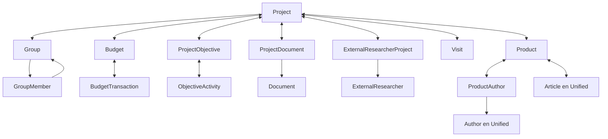

# P0 — coherencia de UnitOfWork y DI

**Resultado: frontera identificada; P0 no activado.** Convertir el UnitOfWork completo exige migrar ProductAuthors, que está explícitamente fuera del alcance. Se cumplió la instrucción de detenerse en ese límite: no se modificaron Program, IUnitOfWork, UnitOfWork ni código operacional en esta fase. La mezcla heredada de la pasada anterior sigue pendiente; no se presenta como runtime funcional.

## A. Mapa del UnitOfWork

IUnitOfWork expone **48 propiedades**: **9 repositorios ya Unified y 39 con AppDbContext**. UnitOfWork recibe el contexto y los 48 repositorios por constructor y los asigna directamente. No los instancia, no usa Lazy, no expone repositorios DW y no implementa BeginTransaction/Commit/Rollback. SaveChangesAsync y DisposeAsync actúan sobre su campo AppDbContext. Algunas propiedades concretas tienen setter público; la interfaz solo publica getters.

Estado se refiere a la migración coherente del repositorio y su operación consumidora, no solo a si compila un cambio de constructor. UNIFIED indica trabajo previo, no activación. BLOCKED incluye hojas mecánicas cuyo contrato/operación está bloqueado. SPECIAL identifica semántica prohibida en esta fase. No se amplió la mezcla después de comprobar que ProductAuthors impide el requisito previo de la sección 10 de la solicitud.

| Propiedad / repository | Contexto anterior | Contexto final | Entidad principal | Estado | Motivo |
| --- | --- | --- | --- | --- | --- |
| Projects / ProjectRepository | AppDbContext | AppDbContext | Project | BLOCKED | ProjectService.ImportFromMatrixAsync asigna FacultyId externo y Visit.AcademicPeriodId; el contrato Project conecta grupos, objetivos, presupuesto, documentos y productos. |
| Groups / GroupRepository | AppDbContext | AppDbContext | Group | BLOCKED | GroupRepository.GetByProjectIdAsync consulta Project y devuelve ProjectGroup. GroupService también modifica Project.FacultyId al agregar un coordinador. |
| GroupMembers / GroupMemberRepository | AppDbContext | AppDbContext | GroupMember | BLOCKED | Contrato compartido con Group y MemberRoleType. GroupService.AddMemberAsync escribe además Project.FacultyId en la misma operación. |
| Budgets / BudgetRepository | AppDbContext | AppDbContext | Budget / BudgetTransaction | BLOCKED | Navegaciones Project, Document y BudgetTransaction; migrar los consumidores que trabajan con Project.Budgets requiere el contrato Project bloqueado. |
| Visits / VisitRepository | AppDbContext | AppDbContext | Visit | BLOCKED | Agregado conectado a Project/Product y uso externo de AcademicPeriodId en ProjectService.ImportFromMatrixAsync; no basta renombrar a AcademicTermId. |
| ProjectExtensions / ProjectExtensionRepository | AppDbContext | AppDbContext | ProjectExtension | BLOCKED | Contrato conectado a Project/Document/Visit. Crear extensión construye Visit legacy; no se activa el conjunto mientras Project/Visit estén bloqueados. |
| VisitIssues / VisitIssueRepository | UnifiedDideDbContext | UnifiedDideDbContext | VisitIssue | UNIFIED | Adaptado en la pasada anterior. Misma instancia Scoped Unified en la prueba; no comparte el contexto de SaveChanges del UoW actual. |
| Convocations / ConvocationRepository | UnifiedDideDbContext | UnifiedDideDbContext | Convocation | UNIFIED | Adaptado en la pasada anterior. Misma instancia Scoped Unified en la prueba; no comparte el contexto de SaveChanges del UoW actual. |
| ProductAttributeDefinitions / ProductAttributeDefinitionRepository | UnifiedDideDbContext | UnifiedDideDbContext | ProductAttributeDefinition | UNIFIED | Adaptado en la pasada anterior. Misma instancia Scoped Unified en la prueba; no comparte el contexto de SaveChanges del UoW actual. |
| ProductValues / ProductValueRepository | AppDbContext | AppDbContext | ProductValue | BLOCKED | ProductRepository carga Values y AttributeDefinition; ProductService usa el mismo contrato Product y sus autores. |
| ProductAuthors / ProductAuthorRepository | AppDbContext | AppDbContext | ProductAuthor | SPECIAL | ExistsForUserAsync consulta UserId; SyncAuthorsAsync crea vínculos con UserId y MapToDetailDTO los proyecta. Unified requiere AuthorId. |
| Products / ProductRepository | AppDbContext | AppDbContext | Product | BLOCKED | GetByIdWithRefsAsync y QueryWithRefs incluyen Authors. MapToDetailDTO usa UserId y asigna ProjectId a un DTO obligatorio. |
| ObjectiveTypes / CatalogRepository<ObjectiveType> | AppDbContext | AppDbContext | ObjectiveType | BLOCKED | CatalogRepository<T> e ICatalogRepository<T> restringen T a CatalogEntityBase legacy. Sus consumidores/UoW comparten esos contratos con agregados Project/Product/Group; no basta cambiar el contexto del genérico abierto. |
| ProjectObjectives / ProjectObjectiveRepository | AppDbContext | AppDbContext | ProjectObjective | BLOCKED | ProjectService construye/asigna Project.ProjectObjectives; los contratos enlazan ObjectiveActivity y VisitObjectiveActivityProgress. |
| ObjectiveActivities / ObjectiveActivityRepository | AppDbContext | AppDbContext | ObjectiveActivity | BLOCKED | Navega a ProjectObjective; su contrato forma parte de los objetivos del Project legacy. |
| ObjectiveActivityUsers / ObjectiveActivityUserRepository | UnifiedDideDbContext | UnifiedDideDbContext | ObjectiveActivityUser | UNIFIED | Adaptado en la pasada anterior. Misma instancia Scoped Unified en la prueba; no comparte el contexto de SaveChanges del UoW actual. |
| Documents / DocumentRepository | AppDbContext | AppDbContext | Document | BLOCKED | Los consumidores construyen ProjectDocument, Visit, ProjectExtension y BudgetTransaction con Document; el grupo cruza Project/Visit. |
| MemberRoleTypeRepository / CatalogRepository<MemberRoleType> | AppDbContext | AppDbContext | MemberRoleType | BLOCKED | CatalogRepository<T> e ICatalogRepository<T> restringen T a CatalogEntityBase legacy. Sus consumidores/UoW comparten esos contratos con agregados Project/Product/Group; no basta cambiar el contexto del genérico abierto. |
| ProjectTypeRepository / CatalogRepository<ProjectType> | AppDbContext | AppDbContext | ProjectType | BLOCKED | CatalogRepository<T> e ICatalogRepository<T> restringen T a CatalogEntityBase legacy. Sus consumidores/UoW comparten esos contratos con agregados Project/Product/Group; no basta cambiar el contexto del genérico abierto. |
| DocumentTypes / CatalogRepository<DocumentType> | AppDbContext | AppDbContext | DocumentType | BLOCKED | CatalogRepository<T> e ICatalogRepository<T> restringen T a CatalogEntityBase legacy. Sus consumidores/UoW comparten esos contratos con agregados Project/Product/Group; no basta cambiar el contexto del genérico abierto. |
| ProjectResearchCategories / ProjectResearchCategoryRepository | AppDbContext | AppDbContext | ProjectResearchCategory | BLOCKED | ProjectService construye Project.ProjectResearchCategories; requiere migrar Project y la cadena de catálogos. |
| ResearchCategories / ResearchCategoryRepository | AppDbContext | AppDbContext | ResearchCategory | BLOCKED | Usado con ProjectResearchCategory y catálogos tipados legacy en ProjectService; la hoja no elimina el bloqueo del contrato compartido. |
| ResearchCategoryTypes / CatalogRepository<ResearchCategoryType> | AppDbContext | AppDbContext | ResearchCategoryType | BLOCKED | CatalogRepository<T> e ICatalogRepository<T> restringen T a CatalogEntityBase legacy. Sus consumidores/UoW comparten esos contratos con agregados Project/Product/Group; no basta cambiar el contexto del genérico abierto. |
| FundingTypes / CatalogRepository<FundingType> | AppDbContext | AppDbContext | FundingType | BLOCKED | CatalogRepository<T> e ICatalogRepository<T> restringen T a CatalogEntityBase legacy. Sus consumidores/UoW comparten esos contratos con agregados Project/Product/Group; no basta cambiar el contexto del genérico abierto. |
| ResearchCategoryGroups / CatalogRepository<ResearchCategoryGroup> | AppDbContext | AppDbContext | ResearchCategoryGroup | BLOCKED | CatalogRepository<T> e ICatalogRepository<T> restringen T a CatalogEntityBase legacy. Sus consumidores/UoW comparten esos contratos con agregados Project/Product/Group; no basta cambiar el contexto del genérico abierto. |
| TransactionTypes / CatalogRepository<TransactionType> | AppDbContext | AppDbContext | TransactionType | BLOCKED | CatalogRepository<T> e ICatalogRepository<T> restringen T a CatalogEntityBase legacy. Sus consumidores/UoW comparten esos contratos con agregados Project/Product/Group; no basta cambiar el contexto del genérico abierto. |
| ExternalResearchers / ExternalResearcherRepository | AppDbContext | AppDbContext | ExternalResearcher | BLOCKED | ExternalResearcherProject y Project.ExternalResearcherProjects mantienen contratos legacy; hay que migrar sus consumidores juntos. |
| Countries / CatalogRepository<Country> | AppDbContext | AppDbContext | Country | BLOCKED | CatalogRepository<T> e ICatalogRepository<T> restringen T a CatalogEntityBase legacy. Sus consumidores/UoW comparten esos contratos con agregados Project/Product/Group; no basta cambiar el contexto del genérico abierto. |
| Institutions / CatalogRepository<Institution> | AppDbContext | AppDbContext | Institution | BLOCKED | CatalogRepository<T> e ICatalogRepository<T> restringen T a CatalogEntityBase legacy. Sus consumidores/UoW comparten esos contratos con agregados Project/Product/Group; no basta cambiar el contexto del genérico abierto. |
| ExternalResearcherProjects / ExternalResearcherProjectRepository | AppDbContext | AppDbContext | ExternalResearcherProject | BLOCKED | ProjectService construye/asigna Project.ExternalResearcherProjects; cambiar solo el repositorio rompe el tipo de navegación. |
| IndexingSources / CatalogRepository<IndexingSource> | AppDbContext | AppDbContext | IndexingSource | BLOCKED | CatalogRepository<T> e ICatalogRepository<T> restringen T a CatalogEntityBase legacy. Sus consumidores/UoW comparten esos contratos con agregados Project/Product/Group; no basta cambiar el contexto del genérico abierto. |
| ProductTypes / CatalogRepository<ProductType> | AppDbContext | AppDbContext | ProductType | BLOCKED | CatalogRepository<T> e ICatalogRepository<T> restringen T a CatalogEntityBase legacy. Sus consumidores/UoW comparten esos contratos con agregados Project/Product/Group; no basta cambiar el contexto del genérico abierto. |
| ProductAttributes / CatalogRepository<ProductAttribute> | AppDbContext | AppDbContext | ProductAttribute | BLOCKED | CatalogRepository<T> e ICatalogRepository<T> restringen T a CatalogEntityBase legacy. Sus consumidores/UoW comparten esos contratos con agregados Project/Product/Group; no basta cambiar el contexto del genérico abierto. |
| ProjectDocuments / ProjectDocumentRepository | AppDbContext | AppDbContext | ProjectDocument | BLOCKED | ProjectDocumentRepository carga Project y Document; ProjectService conserva Project.ProjectDocuments legacy. |
| ProjectStates / CatalogRepository<ProjectState> | AppDbContext | AppDbContext | ProjectState | BLOCKED | CatalogRepository<T> e ICatalogRepository<T> restringen T a CatalogEntityBase legacy. Sus consumidores/UoW comparten esos contratos con agregados Project/Product/Group; no basta cambiar el contexto del genérico abierto. |
| VisitStates / CatalogRepository<VisitState> | AppDbContext | AppDbContext | VisitState | BLOCKED | CatalogRepository<T> e ICatalogRepository<T> restringen T a CatalogEntityBase legacy. Sus consumidores/UoW comparten esos contratos con agregados Project/Product/Group; no basta cambiar el contexto del genérico abierto. |
| ProjectOriginTypes / CatalogRepository<ProjectOriginType> | AppDbContext | AppDbContext | ProjectOriginType | BLOCKED | CatalogRepository<T> e ICatalogRepository<T> restringen T a CatalogEntityBase legacy. Sus consumidores/UoW comparten esos contratos con agregados Project/Product/Group; no basta cambiar el contexto del genérico abierto. |
| ProjectExtensionTypes / CatalogRepository<ProjectExtensionType> | AppDbContext | AppDbContext | ProjectExtensionType | BLOCKED | CatalogRepository<T> e ICatalogRepository<T> restringen T a CatalogEntityBase legacy. Sus consumidores/UoW comparten esos contratos con agregados Project/Product/Group; no basta cambiar el contexto del genérico abierto. |
| ExportTemplateColumns / ExportTemplateColumnRepository | UnifiedDideDbContext | UnifiedDideDbContext | ExportTemplateColumn | UNIFIED | Adaptado en la pasada anterior. Misma instancia Scoped Unified en la prueba; no comparte el contexto de SaveChanges del UoW actual. |
| ExportTemplates / ExportTemplateRepository | UnifiedDideDbContext | UnifiedDideDbContext | ExportTemplate | UNIFIED | Adaptado en la pasada anterior. Misma instancia Scoped Unified en la prueba; no comparte el contexto de SaveChanges del UoW actual. |
| ExportFields / ExportFieldRepository | UnifiedDideDbContext | UnifiedDideDbContext | ExportField | UNIFIED | Adaptado en la pasada anterior. Misma instancia Scoped Unified en la prueba; no comparte el contexto de SaveChanges del UoW actual. |
| VisitObjectiveActivityProgresses / VisitObjectiveActivityProgressRepository | UnifiedDideDbContext | UnifiedDideDbContext | VisitObjectiveActivityProgress | UNIFIED | Adaptado en la pasada anterior. Misma instancia Scoped Unified en la prueba; no comparte el contexto de SaveChanges del UoW actual. |
| FacultyScopes / FacultyScopeRepository | AppDbContext | AppDbContext | FacultyScope | BLOCKED | Conjunto FacultyScope/FacultyScopeFaculty/UserFacultyScopeAssignment: los IDs recibidos requieren revisar su origen externo/local. |
| FacultyScopeFaculties / FacultyScopeFacultyRepository | AppDbContext | AppDbContext | FacultyScopeFaculty | SPECIAL | FacultyScopeService.CreateAsync/SetFacultiesAsync guarda FacultyId recibido sin resolver ExternalFacultyId a ID local. |
| UserFacultyScopeAssignments / UserFacultyScopeAssignmentRepository | AppDbContext | AppDbContext | UserFacultyScopeAssignment | BLOCKED | Comparte FacultyScope y los filtros de facultad; mantener el conjunto coherente exige resolver primero la frontera Faculty. |
| AppConfigurations / AppConfigurationRepository | UnifiedDideDbContext | UnifiedDideDbContext | AppConfiguration | UNIFIED | Adaptado en la pasada anterior. Misma instancia Scoped Unified en la prueba; no comparte el contexto de SaveChanges del UoW actual. |
| AspNetUsers / AspNetUserRepository | AppDbContext | AppDbContext | IdentityUser<int> | BLOCKED | La clase es candidata mecánica local, pero Identity está registrado con AddEntityFrameworkStores<AppDbContext>. Cambiar su contexto aisladamente separaría la persistencia de autenticación y UoW. |
| AppUsers / AppUserRepository | AppDbContext | AppDbContext | AppUser | BLOCKED | La hoja conserva IdUser/IdLocal/IdAsp y es candidata mecánica. Sus operaciones de vinculación usan Identity legacy; la activación completa del UoW está detenida en ProductAuthors. |

Archivo y contrato exactos en [unit-of-work-map.csv](unit-of-work-map.csv). Articles no es una propiedad de IUnitOfWork: ArticleReadRepository usa ArticlesDbContext y permanece separado. BudgetTransaction no tiene un repositorio expuesto independiente; forma parte del presupuesto.

## B. Agregados y componentes del grafo

Se calcularon componentes fuertemente conectados a partir de las propiedades de navegación devueltas por query_graph, verificadas en fuente. Las siguientes listas son SCC de tipos CLR, no límites transaccionales inferidos. Un repositorio puede usar una parte compatible de un componente mayor: por eso Convocation ya pudo migrarse.

### legacy

- **27 tipos:** Budget, BudgetTransaction, Convocation, ConvocationRule, ConvocationRuleIndexing, Document, ExternalResearcher, ExternalResearcherProject, ObjectiveActivity, ObjectiveActivityUser, Product, ProductAttribute, ProductAttributeDefinition, ProductAuthor, ProductValue, Project, ProjectDocument, ProjectExtension, ProjectExtensionType, ProjectObjective, ProjectResearchCategory, ResearchCategory, ResearchCategoryGroup, ResearchCategoryType, Visit, VisitIssue, VisitObjectiveActivityProgress.
- **3 tipos:** ExportField, ExportTemplate, ExportTemplateColumn.
- **3 tipos:** FacultyScope, FacultyScopeFaculty, UserFacultyScopeAssignment.
- **2 tipos:** Country, Institution.
- **2 tipos:** Group, GroupMember.

### unified

- **39 tipos:** AcademicTerm, Article, ArticleFile, ArticleIndexing, Author, Budget, BudgetTransaction, Convocation, ConvocationRule, ConvocationRuleIndexing, Document, DynamicFieldValue, ExternalResearcher, ExternalResearcherProject, Faculty, ObjectiveActivity, ObjectiveActivityUser, Product, ProductAttribute, ProductAttributeDefinition, ProductAuthor, ProductAuthorDynamicFieldValue, ProductValue, Project, ProjectDocument, ProjectExtension, ProjectExtensionType, ProjectObjective, ProjectResearchCategory, PublicationStatus, ResearchCategory, ResearchCategoryGroup, ResearchCategoryType, ResearchLine, Venue, VenueMetric, Visit, VisitIssue, VisitObjectiveActivityProgress.
- **4 tipos:** DynamicFieldOption, FieldCatalogEntry, FormDefinition, FormFieldDefinition.
- **4 tipos:** RegistrationMatrix, RegistrationMatrixCell, RegistrationMatrixColumn, RegistrationMatrixRow.
- **3 tipos:** BroadField, DetailedField, SpecificField.
- **3 tipos:** ExportField, ExportTemplate, ExportTemplateColumn.
- **3 tipos:** FacultyScope, FacultyScopeFaculty, UserFacultyScopeAssignment.
- **2 tipos:** Country, Institution.
- **2 tipos:** Group, GroupMember.

Relaciones verificadas que explican los límites reales:



Group/GroupMember forman su propio SCC; Project apunta a Group, pero Group no tiene navegación inversa a Project. La obligación práctica de coordinarlos proviene de GroupRepository.GetByProjectIdAsync y de las operaciones de GroupService que también escriben Project. Presupuestos, objetivos, documentos e investigadores están en el mismo SCC grande de Project; sus contratos actuales se cruzan en ProjectService. El SCC Unified alcanza Articles por Product/Author; eso no significa que toda consulta de Projects necesite migrar Articles, pero sí impide tratar las navegaciones como equivalencias universales.

[navigation-edges.csv](navigation-edges.csv) conserva origen, propiedad, destino y archivo/línea. DW fue separado y no se propone migrarlo.

## C. Cambios aplicados

**0 archivos de código operacional modificados en esta fase.** Se conservaron los 30 cambios previos y su documentación. No se cambiaron contratos, entidades, migraciones, conexión, servicios de resolución de IDs ni registros DI. Se creó este informe y los siguientes anexos:

- unit-of-work-map.csv: las 48 propiedades y sus contextos anterior/final.
- navigation-edges.csv: relaciones de propiedades usadas para calcular SCC.
- registrations.md: registros reales con línea de Program.cs.
- di-diagnostic.json: resultados de resolución e identidad de las instancias.
- graph-evidence.json y verified-source-hashes.json: consultas, limitaciones y fuentes verificadas.

El diagnóstico temporal reproducible quedó en artifacts/p0-audit/DiProbe.csproj y Program.cs; se ejecuta con `dotnet run --project artifacts/p0-audit/DiProbe.csproj`. No pertenece a la solución ni cambia Program.cs. Usa los métodos reales ConfigureDatabase y ConfigureDependencyInjection mediante reflexión, configuración sintética sin credenciales y descarte asíncrono de scopes.

GenericRepository conserva FindAsync, consultas AsNoTracking, filtros Expression, Add/AddRange, Update, Remove/RemoveRange y Query con tracking opcional. Su constructor público AppDbContext delega al protegido DbContext; la inspección de instancias confirmó que el campo base y los campos derivados mantienen un único contexto por repositorio. No se rediseñó.

## D. Bloqueos restantes

| Prioridad/tema | Frontera exacta | Qué exige para continuar |
| --- | --- | --- |
| P1 ProductAuthor | IUnitOfWork.ProductAuthors → ProductAuthorRepository.ExistsForUserAsync:21; ProductService.SyncAuthorsAsync:376 y MapToDetailDTO:492. | Resolver AppUser/ExternalResearcher → Author y conservar los contratos de entrada/salida acordados. No sustituir UserId por AuthorId directamente. |
| P1 Articles | ArticleReadRepository está fuera de IUnitOfWork y usa ArticlesDbContext. | Fase independiente de Product + Article; no es necesario convertir Articles para demostrar el bloqueo directo de ProductAuthors. |
| P1 ArticleParticipant | La transformación no tiene propiedad/repositorio propio en este UoW; pertenece a Articles. | Definir Author/ProductAuthor, snapshots y campos dinámicos en la fase de Articles; no se adaptó ningún uso. |
| P1 Faculty | ProjectService.ImportFromMatrixAsync; GroupService.AddMemberAsync modifica Project.FacultyId; FacultyScopeService.CreateAsync/SetFacultiesAsync guarda IDs recibidos. | Acreditar o resolver ExternalFacultyId → FacultyId antes de activar estas escrituras. |
| P1 AcademicTerm | ProjectService.ImportFromMatrixAsync:1706 guarda Visit.AcademicPeriodId obtenido del catálogo externo. | Resolver ExternalPeriodId → AcademicTermId local. El null de ProjectExtensionService es mecánico, pero no libera el resto del contrato Visit. |
| P2 agregados restantes | Project/Group, presupuesto, objetivos, documentos, investigadores y catálogos comparten contratos legacy. | Migrar interfaces, tipos y consumidores por conjunto cuando se liberen sus fronteras; no añadir otro ChangeTracker al mismo UoW. |
| P2 Identity/activación | Program.ConfigureIdentity registra AddEntityFrameworkStores<AppDbContext>; AppUsers/AspNetUsers están dentro del UoW. | Coordinar el almacenamiento Identity y las operaciones de vinculación antes de afirmar una única persistencia por operación; no rediseñar autenticación implícitamente. |

El obstáculo suficiente y directo es ProductAuthors: aun migrando todas las hojas equivalentes, conservar esa propiedad legacy haría falsa la afirmación de que todos los repositorios operacionales comparten Unified. No se retiró la propiedad, no se introdujo un segundo UoW ni un puente temporal.

## E. DI

Registros actuales, sin modificación:

```csharp
builder.Services.AddDbContext<AppDbContext>(options => options.UseSqlServer(defaultConnection));
builder.Services.AddScoped<IUnitOfWork, UnitOfWork>();
builder.Services.AddScoped<IProductAuthorRepository, ProductAuthorRepository>();
builder.Services.AddScoped<IVisitIssueRepository, VisitIssueRepository>();
builder.Services.AddScoped(typeof(IGenericRepository<>), typeof(GenericRepository<>));
builder.Services.AddScoped(typeof(ICatalogRepository<>), typeof(CatalogRepository<>));
```

UnifiedDideDbContext **no está registrado**. DwContext mantiene su registro separado; ArticlesDbContext se registra condicionalmente. El listado completo de repositorios y servicios está en [registrations.md](registrations.md). ConnectionStrings:UnifiedDideConnection no se activó: la solicitud condiciona ese registro a que el UoW sea coherente.

La prueba aislada ejecutó los registros reales con Articles deshabilitado, sin construir/iniciar el host. Resultado real:

```text
Unable to resolve service for type 'tesisproject.backend.Data.UnifiedDideDbContext' while attempting to activate 'tesisproject.backend.Repositories.Implementations.VisitIssueRepository'.
```

Luego añadió Unified únicamente a la colección temporal del diagnóstico para comprobar el contraejemplo: IUnitOfWork resolvió, los 9 repositorios Unified recibieron exactamente la misma instancia Scoped Unified, y los otros 39 recibieron la instancia Scoped AppDbContext usada por UnitOfWork. Repetir la resolución de IUnitOfWork en ese scope devolvió la misma instancia. Esto demuestra que los lifetimes Scoped por sí solos no solucionan la frontera de persistencia. No se incorporó ese registro experimental a la aplicación.

## F. SaveChanges

[UnitOfWork.cs](../../tesisproject.backend/UnitOfWork/Implementations/UnitOfWork.cs), líneas 11 y 165–166:

```csharp
private readonly AppDbContext _ctx;
public Task<int> SaveChangesAsync(CancellationToken ct = default)
    => _ctx.SaveChangesAsync(ct);
```

Guarda exclusivamente **AppDbContext**, no Unified. No hay guardado doble. Cambiar solo ese campo haría que los 39 repositorios legacy quedaran fuera del guardado.

## G. Transacciones y DW

No se puede confirmar una única instancia para todos los repositorios: el diagnóstico demuestra dos contextos distintos si se añade el registro faltante. UnitOfWork no publica ni implementa una API de transacciones explícitas. DisposeAsync dispone su AppDbContext. No se introdujeron nuevos DbContexts manuales ni transacciones.

IUnitOfWork no expone DW. DwEtlService recibe AppDbContext para lectura operacional y DwContext para escritura analítica, además de clientes externos. Esa mezcla está en el servicio ETL, no en el UoW; se preservó exactamente y no se ejecutó. Migrar el origen del ETL será otra decisión posterior.

## H. Build y validación

Se reconstruyó TesisProject.sln con `dotnet build TesisProject.sln --no-restore -t:Rebuild --verbosity quiet`: **0 errores, 39 warnings**, iguales al baseline previo. Al no modificar código operacional, esa reconstrucción valida también el estado final de la solución. El diagnóstico DI terminó con código 0. No se inició el backend, no hubo consultas SQL, inserciones, SaveChanges, migraciones ni llamadas externas. La inicialización del modelo legacy emitió seis avisos EF de precisión decimal; son mensajes de runtime distintos de los 39 warnings de compilación y no se corrigieron fuera de alcance.

## I. Codebase Memory y límites de evidencia

Proyecto C-Users-marlo-source-repos-TesisProject: 18.289 nodos y 66.165 aristas. Se usó nivel Verify. list_projects/index_status identificaron el proyecto; get_graph_schema, search_graph y query_graph descubrieron UoW, propiedades, clases de repositorio y campos de entidades; get_code_snippet recuperó los cuerpos relevantes; trace_path se ejecutó en ambas direcciones para SaveChangesAsync y SyncAuthorsAsync.

Se completaron las páginas pertinentes: 34 clases Repository, 97 campos de los dos archivos UoW (48 + 48 + _ctx), 1.022 campos de entidades; los límites de consulta superaban los resultados. Los SCC se calcularon sobre esos campos y no sobre aristas CALLS heurísticas.

check_index_coverage se ejecutó sobre 168 rutas y scopes relevantes. La herramienta requirió rutas relativas y lotes de como máximo 128; se corrigieron ambas restricciones. Aunque index_repository respondió indexed, la generación reportada permaneció 2026-09-06T11:44:59Z y la cobertura siguió mostrando metadata_changed (y not_tracked para el csproj). Por ello se leyeron todas las rutas de evidencia y se contrastaron 42 snippets completos y las 1.022 declaraciones de campo con la fuente actual. No se afirma frescura completa del índice.

Las trazas presentan resolución heurística incorrecta: SyncAuthorsAsync aparece conectado a IExportFieldRepository.AddAsync/Remove y a ProductAuthor Unified, aunque su fuente usa ProductAuthor legacy. La traza de SaveChangesAsync también mezcla código ArticlesMigration excluido y omite consumidores operacionales. Esas aristas no sustentan el diagnóstico; la prueba real de DI y la fuente verificada sí. La reinspección final mantiene UnitOfWork._ctx → AppDbContext y los campos/contextos mixtos anteriores, como corresponde a una fase detenida sin cambios operacionales.

La frontera está documentada y comprobada. **El P0 continúa abierto** hasta autorizar y resolver al menos ProductAuthor y las demás fronteras que afecten las operaciones del UoW.
