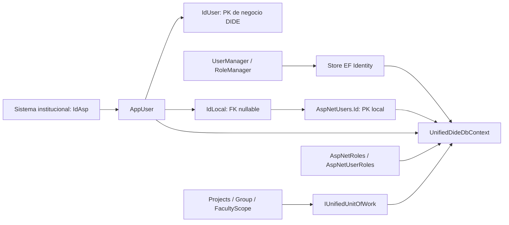

# Cierre Identity / AppUser Unified — 2026-09-07

**12 TODO Identity resueltos; pending.csv queda sin métodos pendientes.**
La composición Identity Unified está implementada y probada, pero el runtime legacy
continúa activo. Program.cs y Controllers no se modificaron. Este informe añade el
cierre de esta fase al histórico de Faculty/AcademicTerm y Products.

## A. Arquitectura Identity preparada

Es **un mismo tipo y una misma instancia scoped de contexto**, con dos owners
secuenciales. No se añadió un segundo contexto operacional. El modelo ya heredaba
de `IdentityDbContext<IdentityUser<int>, IdentityRole<int>, int>`, ejecutaba el mapeo
base Identity y conservaba los vínculos requeridos. No se modificó el modelo ni
se generaron migraciones. El UoW continúa con **50 repositories**.

`AppUser.IdUser` es la PK de negocio; `IdLocal` referencia Identity; `IdAsp` es
institucional y no tiene FK local. Los índices filtrados únicos de IdLocal/IdAsp
ya existían. `UserFacultyScopeAssignment.IdentityUserId` conserva su nombre físico,
pero su FK apunta a **AppUser.IdUser**, no a AspNetUsers.Id.

## B. Abstracciones

| Abstracción | Implementación / responsabilidad |
|---|---|
| IUnifiedIdentityProvisioningService | UnifiedIdentityProvisioningService: ResolveAsync sin escrituras; EnsureAsync para una persona; EnsureSelectedAsync para la selección del caller |
| IUnifiedIdentityQueryService | UnifiedIdentityQueryService: emails y usernames por ID Identity local, consultas AsNoTracking sobre UnifiedDideDbContext |
| IUnifiedAppUserService | UnifiedAppUserService: façade de EnsureAppUser(s); conserva el lookup de negocio IdLocal → IdUser |
| AddUnifiedIdentityBoundary | Registro explícito de los stores EF Unified, managers, queries, provisioning y façade; no invocado por Program.cs |

No hay IUnifiedAspNetUserRepository dentro del UoW. La lógica de provisión vive una
sola vez; el antiguo helper EnsureSingleInternalAsync queda reemplazado por la
implementación especializada de EnsureAsync.

## C–D. Provisión y regla IdAsp

1. Rechazar cambios pendientes en el contexto antes de cualquier escritura Identity.
2. Validar datos requeridos y buscar AppUser por IdAsp **primero**.
3. Buscar Identity por email. Si el AppUser conocido tiene IdLocal, recuperar esa
   cuenta y verificar que la cuenta encontrada por email no sea otra.
4. Si no hay bridge institucional, buscar bridge por el IdLocal resuelto. Un IdAsp
   diferente produce conflicto; uno vacío puede completarse.
5. Validar el rol permitido y su existencia antes de crear una cuenta.
6. Crear Identity si hace falta, usando la contraseña recibida. Asegurar el rol
   sin duplicarlo ni retirar roles previos.
7. Crear/completar el bridge y guardar si cambió. Devolver AppUser.IdUser.

Una identidad conocida puede reutilizarse aunque el email entrante no encuentre
ninguna cuenta: se conserva la cuenta vinculada y no se actualiza su email. Si el
email encuentra otra cuenta, se rechaza. Una FK IdLocal que no resuelve una cuenta
también se trata como conflicto, sin reparar automáticamente datos.

**IdAsp es la identidad institucional canónica. Email es un localizador/atributo.**
El comentario técnico solicitado está junto a la resolución del bridge.

Sin IdAsp: el contrato RegisterRequest existente lo declara `[Required]`; no se
encontró evidencia de un flujo legítimo local-only entre estos participantes.
La frontera institucional devuelve Validation/InvalidRequest con el campo AspUserId,
sin crear usuarios. No se habilitó una modalidad local-only inferida por email;
esa modalidad necesitaría una decisión de negocio independiente.

## E. Conflictos y errores

| ErrorCode | Condición |
|---|---|
| IDENTITY_MAPPING_CONFLICT | IdAsp conocido enlazado a otra cuenta respecto del email; bridge por IdLocal con otro IdAsp; dos bridges incompatibles; cuenta vinculada inexistente |
| IDENTITY_PENDING_DOMAIN_CHANGES | Hay cambios pendientes en el contexto antes de provisionar |
| IDENTITY_ROLE_INVALID | Rol fuera de user/technical/financial/coordinador o no existente en AspNetRoles |
| IDENTITY_PROVISIONING_FAILED | Fallo de UserManager o persistencia durante provisión |

Se reutilizan Common.RequestRequired/InvalidRequest/InvalidId para validaciones.
Las creaciones rechazadas por UserManager conservan sus códigos de validación en
ValidationErrors. Los conflictos se registran con **IdAsp, IdUser, IdLocal y
ResolvedIdentityId**, sin contraseñas ni email en el evento de conflicto.

Se preservan ServiceResult, ErrorType, ErrorCode y ValidationErrors al atravesar
callers. Upload ahora devuelve Fail cuando Import devuelve Fail, incluyendo un
conflicto Identity; no lo convierte en Success con un error oculto en el summary.
Se centralizaron mensajes de los métodos habilitados, reutilizando Shared cuando
existía un equivalente.

## F. Inventario de los doce métodos

| Método legacy → Unified | Antes | Después | Estado |
|---|---|---|---|
| FacultyScope.AssignScopeToUserAsync | Provisionamiento legacy con commit previo | Valida scope, resuelve persona/asignación, provisiona, aplica asignación con IdUser | Resuelto |
| Group.AddMemberAsync | Provisionaba antes de duplicado/facultad | Valida grupo, identidad conocida, duplicado, proyecto, facultad y rol antes de Ensure | Resuelto |
| Group.GetExternalUserByAspNetIdAsync | AspNetUsers repository legacy | Query Identity especializada Unified | Resuelto |
| Group.GetExternalUsersByGroupAsync | AspNetUsers repository legacy | Bridge IdUser→IdLocal y query especializada | Resuelto |
| Group.GetProjectMembersReportAsync | AspNetUsers repository legacy | Query especializada; mantiene cálculos del reporte | Resuelto |
| ProjectMatrix.UploadAsync | Import bloqueado | Import habilitado; propaga fallos con metadatos | Resuelto |
| Project.CreateFullAsync | Mutaciones tracked antes de Ensure | Validación/selección/provisión antes de Add del agregado | Resuelto |
| Project.ImportFromMatrixAsync | Ensure intercalado con filas tracked | Preparación de lote, provisión de seleccionados, aplicación de lote | Resuelto |
| Project.InsertGroupMembersFromDirectoryAsync | Aprovisionaba perfiles antes de limitar la selección | SelectImportedMembers limita primero; helper aplica miembros con IdUser ya resuelto, sin commits | Resuelto |
| AppUser.EnsureAppUserAsync | Lógica legacy | Façade a EnsureAsync | Resuelto |
| AppUser.EnsureAppUsersAsync | Bucle legacy | Façade a EnsureSelectedAsync | Resuelto |
| AppUser.EnsureSingleInternalAsync | Identidad por email con relink inconsistente | Responsabilidad trasladada a la frontera especializada | Resuelto |

## G–I. Callers, commits y personas seleccionadas

**Validación → selección → provisión → mutación del dominio → save del owner.**

CreateFull resuelve Faculty local y valida referencias conocidas, actor, nombre,
código, tipos, roles, categorías, documentos, financiación y referencias externas
antes de Ensure. Usa todos los miembros del request que va a vincular. El actor
autenticado se resuelve por **IdLocal → IdUser**, consistente con el token Identity;
las pruebas usan IDs diferentes (17 y 41).

Group valida duplicados contra el AppUser conocido antes de provisionar, y prepara
facultad/proyecto del coordinador sin modificar entidades. FacultyScope valida el
scope y consulta la asignación cuando ya puede conocer el IdUser.

Import mantiene el **save de dominio por lote** observado en legacy. Primero prepara
todas las filas seleccionadas, referencias locales y miembros; después provisiona;
solo entonces añade Groups, Projects y dependientes. No intercalará la provisión
de la segunda fila con entidades pendientes de la primera. Conserva la similitud
de nombres, el máximo de dos por categoría y la marca histórica del primero cuando
hay dos. Los perfiles descartados por ese máximo no se provisionan. Un mismo usuario
retenido en varias categorías/filas se reutiliza idempotentemente.

Los helpers SelectImportedMembers e InsertGroupMembersFromDirectoryAsync no hacen
commits. Bootstrap/reports/queries no provisionan ni guardan. Upload delega el
único save de dominio al import. CreateFull, Group.AddMember y AssignScope guardan
el dominio una vez. Las referencias Faculty/AcademicTerm siguen pasando por lookup
local; las visitas usan la fila preparada de la fase anterior.

Identity puede hacer varios saves por persona: cuenta, rol y bridge. Una repetición
sin cambios no escribe. Si el tercer usuario falla, las provisiones terminadas de
los anteriores se conservan. **Un fallo posterior de Project no borra Identity,
AppUser ni roles válidamente provisionados.** No hay rollback global ni transacción
global entre ambos owners.

La protección adicional `ChangeTracker.HasChanges()` rechaza incluso un caller que
incumpla el orden: su agregado pendiente no puede ser confirmado por UserManager.
Después de un fallo del dominio se debe terminar/descartar ese scope de contexto;
no se ofrece un reset general del tracker ni reutilización automática de un scope fallido.

Compensación limitada: si una cuenta fue creada en esa misma provisión incompleta,
se deshace la preparación del bridge y se intenta retirar sus membresías y eliminar
esa cuenta. Las membresías se retiran explícitamente porque el modelo Unified usa
NoAction, también en Identity. Se registran fallos de limpieza. Nunca se elimina
una cuenta preexistente ni se ejecuta esa compensación desde Project. Una operación
fallida sobre un usuario preexistente puede haber añadido ya un rol válido; no se
retiran roles de usuarios preexistentes como rollback del dominio.

## J–K. ExternalResearcher y contraseñas

ExternalResearcher sigue fuera de Identity. CreateFull vincula sus IDs; import
conserva la referencia legacy de participación externa y verifica su existencia.
No se crean cuentas, bridges ni roles Identity para ellos. No se modificó Products,
Author ni ProductAuthor.

La contraseña fija legacy se conserva temporalmente en:

- UnifiedProjectService: DefaultHardcodedPassword, usado por CreateFull e import.
- UnifiedGroupService: TemporaryPassword, usado por AddMember.
- UnifiedFacultyScopeService: TemporaryPassword, usado por AssignScopeToUser.

Los valores no se reproducen en el informe ni se registran en logs. Es deuda de
seguridad para una fase posterior; no se diseñaron invitaciones ni resets.
El dump diagnóstico del summary completo a C:\temp no se incorporó al Upload
Unified final; no era una regla de negocio y exponía datos innecesariamente.

## L. DI y ownership

`Services/Unified/UnifiedIdentityRegistration.cs` implementa
`AddUnifiedIdentityBoundary()` con **AddEntityFrameworkStores<UnifiedDideDbContext>()**.
Conserva opciones de contraseña, email único, roles y SignInManager del registro
legacy. La composición futura requiere el contexto scoped, los 50 repositories
Unified y UnifiedUnitOfWork, además de los servicios de dominio y clientes externos.
La extensión registra explícitamente las dos fronteras y el façade AppUser.

Program.cs continúa usando Identity legacy porque sus Controllers todavía consumen
servicios/UoW legacy. Cambiar únicamente el store Identity ahora mezclaría modelos
en una misma operación. La extensión está probada aisladamente y preparada para
la fase de integración; no mantiene AppDbContext como arquitectura Identity final.

UnifiedUnitOfWork conserva DisposeAsync del contexto recibido. DI también posee
ese contexto. Se observó/documentó este doble ownership y no se amplió la fase con
una refactorización de Dispose. Las pruebas componen el UoW real y el scope se
dispone asincrónicamente.

## M. Pruebas

`dotnet run --project tests/tesisproject.unifiedservicetests --no-restore`:
**PASS: 4822 aserciones**. El contador incluye checks compilados de dependencias,
por lo que no representa 4822 escenarios independientes.

IdentityProvisioningTests usa **UserManager, RoleManager, store EF, modelo Unified,
repositories y UnifiedUnitOfWork reales**, con Microsoft.EntityFrameworkCore.InMemory
9.0.8. El interceptor captura los tipos guardados por cada save y permite inyectar
fallos de bridge y Project. Solo los proveedores externos son dobles en esos escenarios.

Casos: usuario nuevo/contraseña/rol; reutilización sin escrituras; Identity sin
bridge; completar IdAsp vacío; conflictos de IdAsp/IdLocal/email sin relink ni writes;
rol agregado, repetido, default, inválido y no sembrado; rechazo sin IdAsp;
cuenta incompleta y limpieza limitada; tercero fallido con dos usuarios conservados;
Project fallido con identidad conservada; validación anticipada; Group duplicado y
facultad inválida sin provisión; alta de subrogante; tres lecturas Identity en Group;
scope con IdUser de negocio; ExternalResearcher fuera de Identity; import de dos
filas con selección limitada y FK AcademicTerm local; rechazo de tracker sucio;
ningún save Identity contiene Project/Group; Upload conserva el conflicto original.

No se abrió BD real. InMemory **no valida transacciones SQL Server, restricciones
relacionales ni carreras concurrentes**. Los índices/FK se verifican en el modelo;
la ejecución contra SQL Server queda para integración. No se afirma una prueba
de rollback SQL real a partir de este proveedor.

## N. Build y alcance

`dotnet build TesisProject.sln --no-restore -t:Rebuild --verbosity quiet`:
**0 errores, 39 warnings, 0 warnings nuevos**.
`git -c core.whitespace=cr-at-eol diff --check` pasa.

Legacy, Program.cs, Controllers, frontend, DW, Articles, modelo/migraciones y
Products se preservan respecto del inicio de la fase. No se activa runtime,
no se provisionan usuarios reales ni se ejecutan migraciones.

## O. Codebase Memory

Proyecto C-Users-marlo-source-repos-TesisProject, Verify acotado. Refresh full
terminado: **21308 nodos / 85346 aristas**. Generación reportada
`2026-09-07T18:17:23Z`; cobertura registrada `2026-09-07T18:22:19Z`, complete,
generation_matches=true. Persisten avisos metadata_changed incluso tras refresh;
por ello se verificaron fuente y tipos compilados.

Se trazó EnsureSelectedAsync hacia sus callers Project.CreateFull, Import y façade;
EnsureAsync se verificó contra UserManager, UoW y UnifiedDideDbContext en fuente.
Las aristas heurísticas que atribuían Create/Delete/SaveChanges a clases homónimas
de otros dominios se descartaron por receptor tipado. No se analizaron esos dominios.
La composición probada confirma el store final Unified y el UoW sobre el mismo contexto.

Cobertura consultada para interfaces/implementaciones modificadas, DI preparada,
errores Shared, pruebas, contexto/configuraciones y UoW. Huecos relevantes leídos
directamente: AcademicReferenceTests.cs:167 y UnifiedAcademicReferencePreparation.cs:46.
El csproj se leyó directamente por not_tracked. Las páginas relevantes quedaron
completas. Búsqueda acotada y checks compilados no encontraron dependencias activas
de Services Unified a AppDbContext, IUnitOfWork legacy o interfaces de repositories
legacy. El GenericRepository compartido sigue siendo infraestructura previa de los
repositories Unified; no se introdujo una dependencia nueva de servicios legacy.

La fase se detiene aquí, antes de Controllers/integración runtime y Articles.
